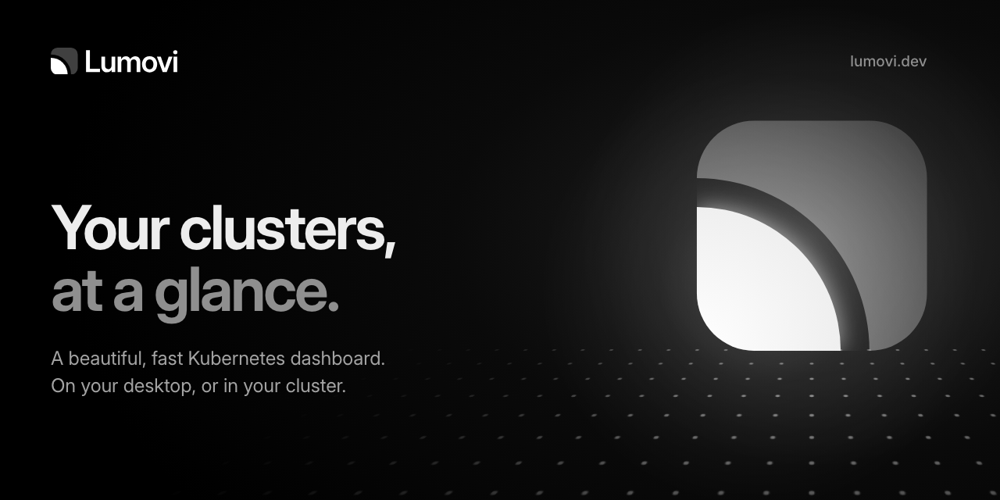

<div align="center">

<picture>
  <source media="(prefers-color-scheme: dark)" srcset="logo/svg/lumovi-logo-on-dark.svg" />
  
</picture>

<br />
<br />

**Lumovi's brand: the logo, app icons, colors, type and media for the app, the website and the
docs.**

[**Guidelines**](guidelines/README.md) · [Logo](#logo) · [App icons](#app-icons) ·
[Colors](#colors) · [Social](#social-and-github) · [Media](#media) ·
[Building](#building-the-assets)

</div>


Lumovi is a beautiful, fast Kubernetes dashboard, on your desktop or in your cluster. It was
called KubeStacks. This repository is the source of everything it looks like: every asset is
built from a few files in [`src/`](src), so they all agree, and you can grab whatever you need
from the folders below.

**The idea.** Lumovi is _lumen_ and _view_. The mark is the corner of a view, an **L**, holding
an **orb of light**; together they're also **Lo**, the start of the name. Read more in the
[brand guidelines](guidelines/README.md).

## What's here

| Folder                      | What                                                                                        |
| --------------------------- | ------------------------------------------------------------------------------------------- |
| [`logo/`](logo)             | The logo, stacked logo, mark and wordmark, as SVG and PNG, in every version; animated marks |
| [`icons/app/`](icons/app)   | The app's icons: macOS (PNG, ICNS, Liquid Glass), Windows (ICO) and Linux (PNG)             |
| [`icons/web/`](icons/web)   | Favicons, touch icons, web app icons and a web manifest                                     |
| [`colors/`](colors)         | The palette and the app's theme tokens: CSS, Tailwind, design tokens, Adobe and GIMP        |
| [`social/`](social)         | Link previews, GitHub's social previews and profile banner, an avatar and a header          |
| [`media/`](media)           | Wallpapers, and the installers' artwork (macOS disk image, Windows installer)               |
| [`snippets/`](snippets)     | The mark as a React and an Astro component, and the HTML `<head>` tags for the icons        |
| [`guidelines/`](guidelines) | How to use all of it                                                                        |

## Logo


Files are named `lumovi-<kind>-<version>`, in [`logo/svg/`](logo/svg) and
[`logo/png/`](logo/png):

| Kind           | What                                      |     | Version         | For                                  |
| -------------- | ----------------------------------------- | --- | --------------- | ------------------------------------ |
| `logo`         | The mark beside the wordmark: the default |     | `on-dark`       | Color, on dark backgrounds           |
| `logo-stacked` | The mark above the wordmark               |     | `on-light`      | Color, on light backgrounds          |
| `mark`         | The mark alone                            |     | `flat-on-dark`  | Without gradients, on dark           |
| `wordmark`     | The name alone                            |     | `flat-on-light` | Without gradients, on light          |
|                |                                           |     | `white`         | One color, on photos and Lumovi Blue |
|                |                                           |     | `black`         | One color, for print                 |

In a README, switch between them with the reader's theme:

```html
<picture>
  <source media="(prefers-color-scheme: dark)" srcset="lumovi-logo-on-dark.svg" />
  
</picture>
```

[`logo/animated/`](logo/animated) has the mark moving, for splash screens and loading states:
an intro that plays once, and a loading mark whose orb breathes. Both hold still for people who
ask for reduced motion.

## App icons


### In the app

| File                                               | Goes to                                |
| -------------------------------------------------- | -------------------------------------- |
| `icons/app/macos/icon.png`                         | `build/icon.png`                       |
| `icons/app/macos/Lumovi.icon/`                     | `build/Lumovi.icon/`                   |
| `icons/app/windows/icon.png`                       | `build/icon-win.png`                   |
| `icons/app/linux/`                                 | `build/icons/`                         |
| `media/installer/dmg-background.png` and its `@2x` | `build/background.png` and its `@2x`   |
| `media/installer/nsis-sidebar.bmp`                 | `build/installerSidebar.bmp`           |
| `media/installer/nsis-header.bmp`                  | `build/installerHeader.bmp`            |
| `icons/web/favicon.svg`                            | `src/renderer/public/favicon.svg`      |
| `snippets/react/Logo.tsx`                          | `src/renderer/src/components/Logo.tsx` |
| `colors/tokens.css` (the semantic tokens)          | `src/renderer/src/styles/index.css`    |

electron-builder finds the installer artwork in `build/` by those names. The rest goes in
`electron-builder.yml`:

```yaml
mac:
  # The Liquid Glass icon. electron-builder compiles it with Xcode's actool (Xcode 26 or
  # later, on the Mac that builds), along with the .icns older versions of macOS show.
  # Without Xcode 26, leave this out and build/icon.png is used.
  icon: build/Lumovi.icon
win:
  icon: build/icon-win.png
linux:
  icon: build/icons
nsis:
  installerHeader: build/installerHeader.bmp
```

`icons/app/macos/icon.icns` is there too, for anything that wants one. The app's window and
dock in development use `build/icon.png`, and the Helm chart's `icon` can point at
`icons/app/macos/icon.png` here.

### On the website and in the docs

| File                                | Website                                 | Docs (Mintlify)  |
| ----------------------------------- | --------------------------------------- | ---------------- |
| `icons/web/*`                       | `public/`                               | `favicon.svg`    |
| `social/og/lumovi.png`              | `public/og.png`                         |                  |
| `snippets/astro/LumoviLogo.astro`   | `src/components/logos/LumoviLogo.astro` |                  |
| `snippets/html/head.html`           | `src/layouts/Base.astro`                |                  |
| `logo/svg/lumovi-logo-on-light.svg` |                                         | `logo/light.svg` |
| `logo/svg/lumovi-logo-on-dark.svg`  |                                         | `logo/dark.svg`  |

The docs' colors, in `docs.json`:

```json
"colors": { "primary": "#2675d3", "light": "#5ea2f0", "dark": "#2675d3" }
```

## Colors


| Color           | Hex       |     | Color     | Hex       |
| --------------- | --------- | --- | --------- | --------- |
| **Lumovi Blue** | `#2675d3` |     | **Night** | `#0a0f1f` |
| **Daylight**    | `#3987e5` |     | **Ink**   | `#0b0b0f` |
| **Lumen**       | `#8cc2ff` |     | **Paper** | `#ffffff` |

[`colors/`](colors) has them in every form:

- **`tokens.css`**: the palette (`--lumovi-blue-600`, …) and the app's semantic tokens
  (`--surface`, `--text-1`, `--accent`, …) for light and dark. Dark follows the system unless
  `data-theme` on `<html>` says otherwise, as in the app.
- **`tailwind.css`**: the palette as Tailwind CSS v4 colors (`bg-lumovi-blue-600`).
- **`tokens.json`**: design tokens in the W3C format, for Figma plugins and Style Dictionary.
- **`lumovi.ase`** and **`lumovi.gpl`**: swatches for Adobe apps, and for GIMP and Inkscape.

## Social and GitHub

| File                                 | For                                                                     |
| ------------------------------------ | ----------------------------------------------------------------------- |
| `social/og/lumovi.png`               | The website's link preview (2400 × 1260)                                |
| `social/og/lumovi-docs.png`          | The docs' link preview                                                  |
| `social/github/<repository>.png`     | Each repository's social preview: _Settings → General → Social preview_ |
| `social/github/profile-banner-*.png` | The organization's profile README, in light and dark                    |
| `social/avatar.png`                  | The organization's avatar, and on X, Bluesky, Mastodon and Discord      |
| `social/header.png`                  | The header on X, Bluesky and Mastodon (clear of the avatar)             |



## Media

| File                                          | What                                                               |
| --------------------------------------------- | ------------------------------------------------------------------ |
| `media/wallpapers/lumovi-desktop-16x9-*.jpg`  | 5120 × 2880, for 16:9 displays, in dark and light                  |
| `media/wallpapers/lumovi-desktop-16x10-*.jpg` | 3456 × 2160, for MacBooks and other 16:10 displays                 |
| `media/wallpapers/lumovi-phone-*.jpg`         | 1290 × 2796, for phones                                            |
| `media/installer/`                            | The macOS disk image's window and the Windows installer's pictures |

## Building the assets

Everything outside `src/` and `scripts/` is built, so change the source and build again rather
than editing the files themselves.

```sh
npm ci
npm run build                  # everything (about 30 seconds)
npm run build -- logo icons    # only some of it
npm run build:vector           # only SVG, CSS and JSON, in a second
npm run check                  # whether those are up to date with src/, as CI checks
```

Images are rendered with Chrome, through Playwright: your Google Chrome if you have it, or
Playwright's Chromium (`npx playwright install chromium`). Node.js 24 or later.

| Source                               | What it defines                                              |
| ------------------------------------ | ------------------------------------------------------------ |
| [`src/colors.ts`](src/colors.ts)     | Every color, and the app's theme tokens                      |
| [`src/mark.ts`](src/mark.ts)         | The mark's geometry and how it's painted                     |
| [`src/wordmark.ts`](src/wordmark.ts) | The wordmark, from Outfit SemiBold, with its spacing and dot |
| [`src/logo.ts`](src/logo.ts)         | The lockups and their versions                               |
| [`src/icon.ts`](src/icon.ts)         | The app icons, for each platform and size                    |
| [`src/scene.ts`](src/scene.ts)       | The brand's imagery: social cards, banners, wallpapers       |
| [`scripts/tasks/`](scripts/tasks)    | One task per folder of assets                                |

See [CONTRIBUTING.md](CONTRIBUTING.md) to propose a change.

## License

The files and code here are licensed under the [Apache License 2.0](LICENSE). The Lumovi name
and logo are trademarks of the Lumovi project: you're welcome to use them to refer to Lumovi,
as the [guidelines](guidelines/README.md#the-name-and-logo-are-trademarks) describe, but not
for your own products. The fonts are by their authors, under the SIL Open Font License.

<sub>Kubernetes is a registered trademark of the Linux Foundation.</sub>
