# Lumovi brand guidelines

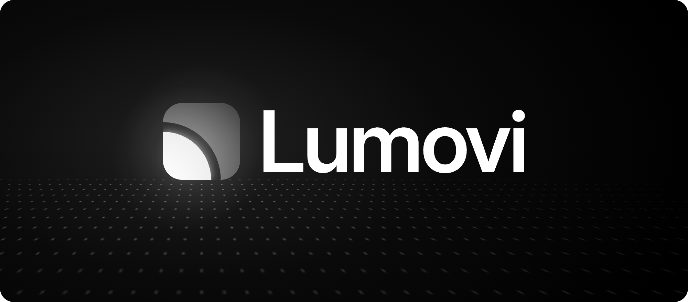

How Lumovi looks, and how to use its logo, colors and type, whether you're working on the app,
the website or the docs, or writing about Lumovi elsewhere. Every file mentioned here is in this
repository; the [README](../README.md#whats-here) says where each one goes.

**[The brand book (PDF, 66 pages)](lumovi-brand-guidelines.pdf)** has all of this in more detail,
laid out to read on screen or to print: construction, proportions, every version, color
values and contrast, the type scale, the app icon's anatomy, imagery, motion and voice.

- [The idea](#the-idea)
- [The logo](#the-logo)
- [Using the logo](#using-the-logo)
- [The app icon](#the-app-icon)
- [Color](#color)
- [Status](#status)
- [The sponsor card](#the-sponsor-card)
- [The clusters page](#the-clusters-page)
- [The Fleet page](#the-fleet-page)
- [On a phone](#on-a-phone)
- [The menu on Windows and Linux](#the-menu-on-windows-and-linux)
- [Typography](#typography)
- [Imagery](#imagery)
- [Writing about Lumovi](#writing-about-lumovi)
- [The name and logo are trademarks](#the-name-and-logo-are-trademarks)

## The idea

Lumovi is _lumen_ and _view_: light on what's happening in your clusters, so you can see what's
healthy, what's struggling and where to look first, at a glance.

The mark is **Sweep**: a square, and **light sweeping across it** from one corner, the way
Lumovi takes in a whole cluster at once. It's drawn only from circles, and set in black, white
and gray, so the product and what it shows come first.

Lumovi was KubeStacks.

## The logo

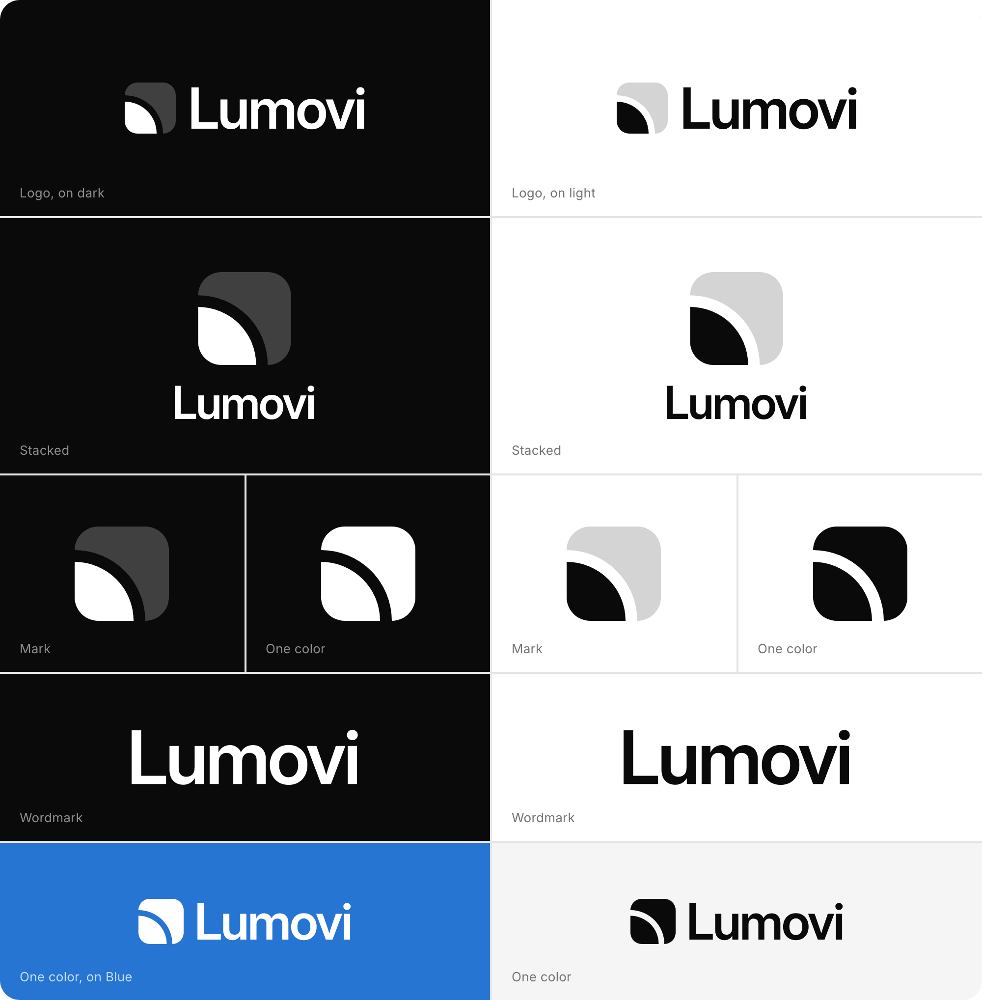

| Version                      | Use it for                                                                      | Files                   |
| ---------------------------- | ------------------------------------------------------------------------------- | ----------------------- |
| **Logo** (mark and wordmark) | The first choice: headers, navigation bars, title slides, anything with room.   | `lumovi-logo-*`         |
| **Stacked**                  | Square spaces: a splash screen, a sticker, a slide's center.                    | `lumovi-logo-stacked-*` |
| **Mark**                     | Small or square spaces where the name is already nearby: icons, avatars, a tab. | `lumovi-mark-*`         |
| **Wordmark**                 | Text-only places, and where the mark is already shown.                          | `lumovi-wordmark-*`     |

Each comes in versions for the background it goes on:

- **`on-dark`** and **`on-light`**: in two tones, the light and its shade. Use these wherever
  you can. On dark backgrounds the light is white and the shade dark gray; on light ones the
  light is ink and the shade a pale gray.
- **`white`** and **`black`**: one color, for photos, the blue, one-color printing, and
  engraving. The gap between the light and the shade keeps the mark readable.

The wordmark is "Lumovi" in Inter Display Semibold, the typeface the app is set in, tracked a
little tighter than the font. It's artwork, not text: use the files, and don't retype it. It's
one color, so it comes in white and black.

### Construction

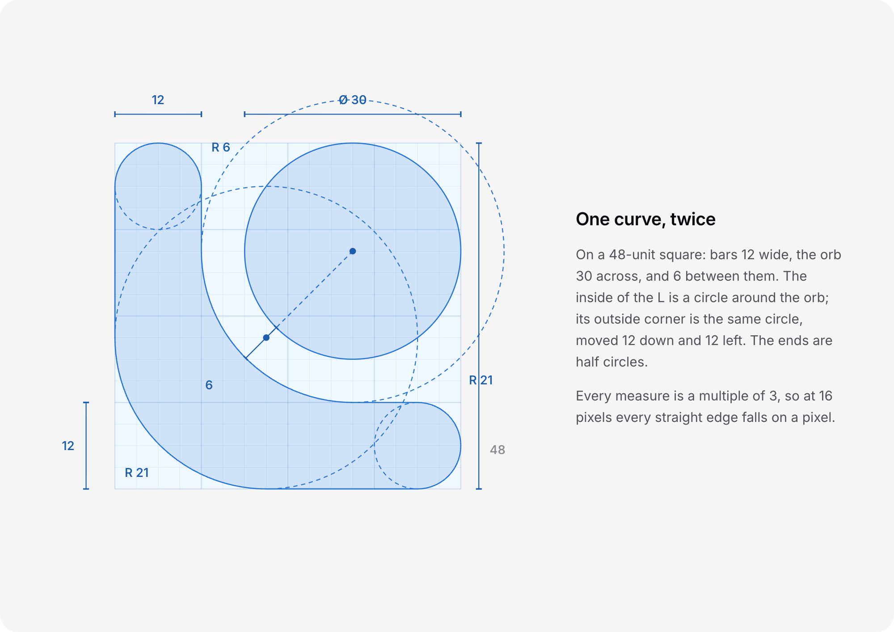

The mark is drawn on a 48-unit square, from circles only. Beside the wordmark it's a little
taller than the capitals (1.24 times) and centered on them, with a gap of a little over a third
of their height. The source of truth for all of this is [`src/mark.ts`](../src/mark.ts) and
[`src/logo.ts`](../src/logo.ts).

## Using the logo

### Clear space

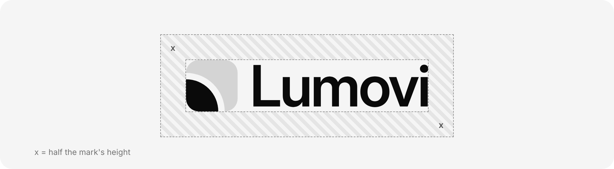

Keep space around the logo equal to **half the mark's height** (x), on every side, free of text,
edges and other logos.

### Minimum size

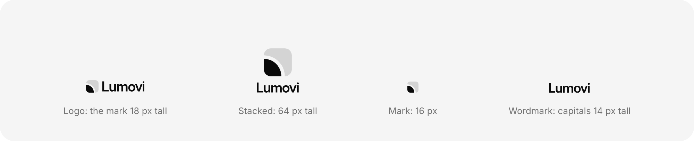

| Version  | Smallest on screen  | Smallest in print |
| -------- | ------------------- | ----------------- |
| Logo     | the mark 18 px tall | the mark 5 mm     |
| Stacked  | 64 px tall          | 18 mm             |
| Mark     | 16 px               | 4 mm              |
| Wordmark | capitals 14 px tall | capitals 3 mm     |

Below these sizes, use the mark alone. At 16 pixels its edges land on whole pixels.

### Backgrounds

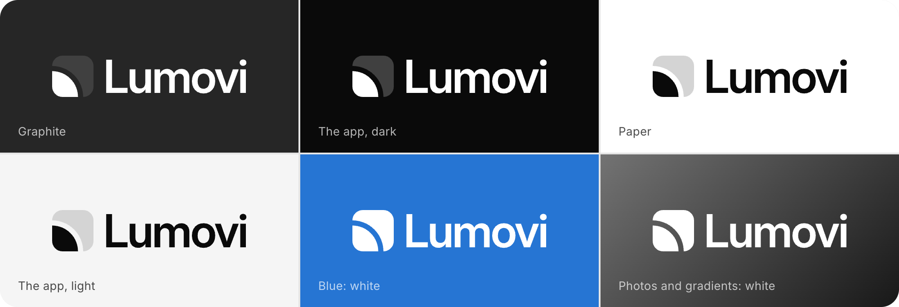

Use the two-tone logo on graphite, paper and the app's own backgrounds. On the blue, on photos
and on gradients, use the white logo, and make sure what's behind it is quiet and dark enough
to read.

### Things to avoid

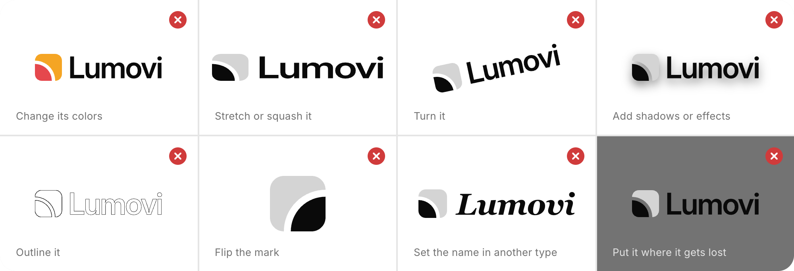

Don't color the logo, change its proportions, turn it, flip it (the light always comes from the
bottom left), outline it, add shadows or effects to it, or redraw the wordmark in another
typeface. The glow belongs to the app icon and the brand's imagery, not to the logo.

## The app icon

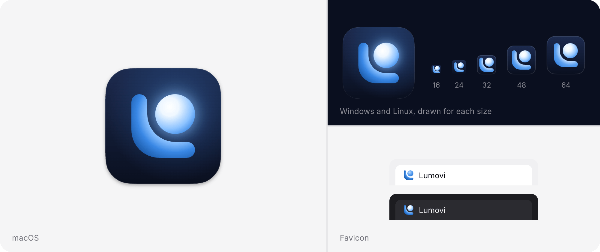

The mark, lit, on a plate of graphite: the light glows white, and lights the shade beside it,
brightest along the curve.

- **macOS** follows Apple's grid: an 824-pixel plate with continuous corners on a 1024 canvas,
  room for its shadow, and the mark a little over half the plate. For macOS 26 and later
  there's also a **Liquid Glass** icon (`Lumovi.icon`), with the light and the shade as glass
  layers, so the system can light and tint it in each appearance.
- **Windows and Linux** use the plate edge to edge, as icons there do, and every size is drawn
  for itself: up to 96 pixels the mark is larger, and at 16 and 20 pixels the gap narrows to a
  single pixel.
- **The Microsoft Store** package has the same icon at every size Windows asks for, and its
  tiles have it in the middle, on transparency, so Start's tile color shows around it.
- **Favicons** are the mark alone, which reads best at tab size, in the colors for the
  browser's theme. `favicon.ico` can't follow the theme, so it's the app icon.

Use the icon as it is. Don't redraw it, put it on another plate, or use it as the logo in
running text.

## Color

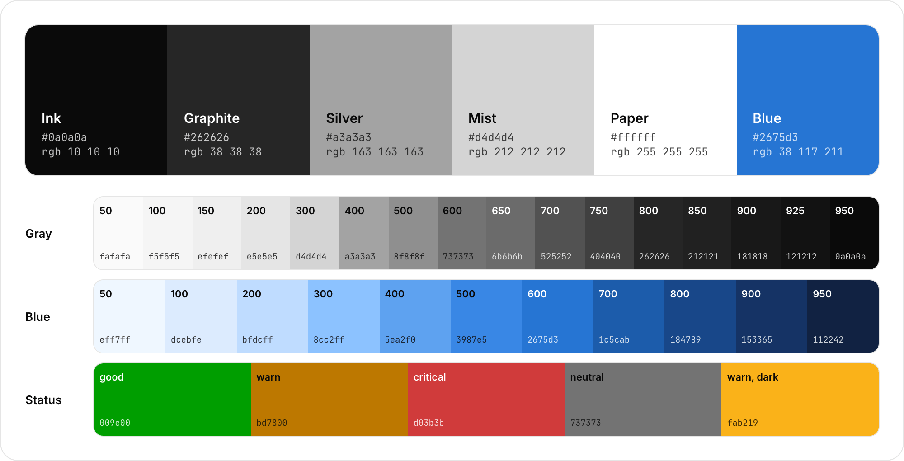

| Color        | Hex       | Use                                                  |
| ------------ | --------- | ---------------------------------------------------- |
| **Ink**      | `#0a0a0a` | Text, the logo, and the light in the mark on light.  |
| **Graphite** | `#262626` | Dark surfaces, and the app icon.                     |
| **Silver**   | `#a3a3a3` | Quieter text on dark backgrounds.                    |
| **Mist**     | `#d4d4d4` | Lines, and the mark's shade on light.                |
| **Paper**    | `#ffffff` | Light surfaces, and the logo on dark.                |
| **Blue**     | `#2675d3` | Only for what you can act on: links, buttons, focus. |

The brand is black, white and gray: **true neutral grays**, without a tint, the way Vercel and
Apple present themselves. Color is kept for meaning.

- **Blue** is for what you can act on (links, buttons, focus and selection), as in Apple's
  interfaces. It isn't the brand: never color the logo with it. Blue 600 (`--accent`) is for
  fills, rings and icons, in both themes. Blue words use `--accent-strong` (Blue 700 on light,
  400 on dark), which reaches 4.5:1 on every surface; Blue 600 is only 4.00:1 on gray 150.
- **Text** reaches 4.5:1 on every surface of its theme (WCAG AA). Quiet text (`--text-3`) is
  gray 650 on light (4.63:1 on gray 150, the darkest light surface) and gray 500 on dark.
- **Status colors** say how things are, and nothing else. See [Status](#status).
- The **data colors** for charts (`--series-1` to `--series-8`) are ordered so that neighbors
  stay apart for color-blind readers. Use them in that order.
- A chart's **reference lines** (a request, a limit, a recommendation) are dashed, and each
  label gives the line's name and its value, "Request 500m", in every chart and wherever the
  label sits: the axis can't say exactly where 500m is, and a pod's chart has nothing else that
  does. A label keeps off the data and the other lines; where nothing is clear, it sits on the
  card's surface, with a hairline.

The palette, and the app's semantic tokens for light and dark, are in [`colors/`](../colors) as
CSS custom properties, a Tailwind theme, design tokens (JSON), and Adobe and GIMP swatches.

### Buttons

A filled button's label is white, and reaches 4.5:1 at rest and on hover, in both themes alike:
hover deepens the fill, never lightens it.

| Button            | Fill                                  | White label |
| ----------------- | ------------------------------------- | ----------- |
| Primary           | Blue 600 `#2675d3` (`--accent`)       | 4.60:1      |
| Primary, on hover | Blue 700 `#1c5cab` (`--accent-hover`) | 6.63:1      |
| Danger            | `#d03b3b` (`--critical`)              | 4.80:1      |
| Danger, on hover  | `#bb3535` (`--critical-hover`)        | 5.72:1      |

- **Focus** is a 2-pixel ring in Blue 600, set off from the button by a pixel or two, so it
  stands out from the button's own fill. It reaches 4.00:1 on any light surface and 3.50:1 on
  any dark one, over the 3:1 a focus ring needs.
- **Pressed** buttons move down a pixel; the color doesn't change again.
- **Disabled** buttons are at half opacity. They don't need to reach 4.5:1, but they still need
  their label.
- Dark mode used Blue 500 for buttons, and white on it is only 3.64:1. Lightening on hover
  made it worse (2.66:1 on Blue 400).

## Status

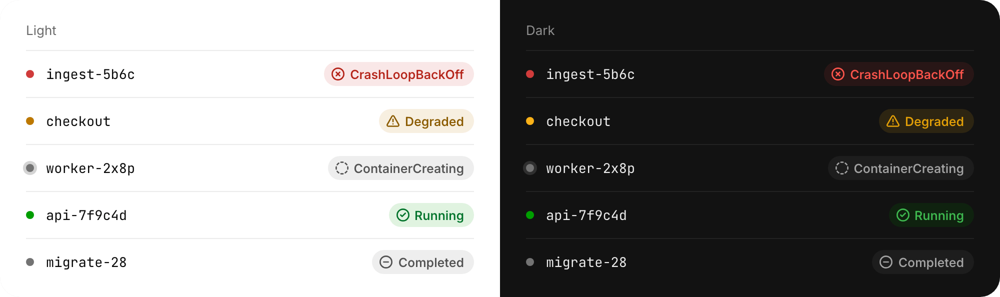

Five levels of health, the same in the app, the docs and the website. Every object Lumovi
shows has one, and lists sort by it, in this order, so what needs you is at the top.

| Level           | Filter chip | Icon ([Lucide](https://lucide.dev)) | Color             | Means                                                                              |
| --------------- | ----------- | ----------------------------------- | ----------------- | ---------------------------------------------------------------------------------- |
| **Critical**    | Failing     | `circle-x`                          | `critical`        | Broken, and won't fix itself: a crash loop, a failed job, a node that isn't ready. |
| **Warning**     | Warning     | `triangle-alert`                    | `warn`            | Working, but not as it should: degraded, under pressure, pending, terminating.     |
| **Progressing** | In progress | `circle-dashed`                     | `neutral`, moving | On its way: creating containers, reconciling, running a job.                       |
| **Healthy**     | Healthy     | `circle-check`                      | `good`            | Doing what it's meant to.                                                          |
| **Neutral**     | Inactive    | `circle-minus`                      | `neutral`         | Nothing to worry about: completed, suspended, scaled to zero.                      |

A list can name a level in its own words, like Running, Starting or Completed for pods. The
level, and so its color and icon, stays the same. One word has one look: where a word could mean
two levels in the same list, the one that isn't its usual meaning takes another word. A pod's
Running is healthy, so a job that's still running says In progress.

| Color      | Mark, light      | Mark, dark       | Words, light     | Words, dark      |
| ---------- | ---------------- | ---------------- | ---------------- | ---------------- |
| `critical` | `#d03b3b` 4.18:1 | `#d03b3b` 3.35:1 | `#b42318` 4.84:1 | `#fc554c` 4.56:1 |
| `warn`     | `#bd7800` 3.12:1 | `#fab219` 8.78:1 | `#8a5a00` 4.56:1 | `#e3a008` 5.59:1 |
| `good`     | `#009e00` 3.10:1 | `#009e00` 4.52:1 | `#00732b` 4.55:1 | `#3fb950` 5.54:1 |
| `neutral`  | `#737373` 4.12:1 | `#737373` 3.40:1 | `#525252` 5.92:1 | `#a3a3a3` 5.61:1 |

Each ratio is the lowest on any surface of its theme (`--surface`, `--surface-2`, `--app-bg`
and `--surface-3`), and for words on the pill's fill over each of them too.

- **Never color alone.** A dot sits beside a name, and a pill has its icon and its word.
- **Marks and words.** Dots, bars and a pill's fill use the color's token (`--good`, `--warn`,
  `--critical`, `--neutral`) and need 3:1 (WCAG 1.4.11). Words use its `*-text` token and need
  4.5:1. Only warn differs between themes: amber as bright as the dark theme's can't reach 3:1
  on white, so the light theme's is deeper.
- **A pill** is its words on its mark at 12%, over whatever it's on.
- **Progressing is neutral, moving.** Its dot pulses, to 45% opacity and back every 2 s
  (ease-in-out), and the dashed circle on its pill turns once every 3 s (linear). Both hold
  still for people who ask for reduced motion; the icon and the word still say it.
- **Blue is never a status**, not even for something in progress. It's for what you can act on.
- **Four colors, five levels.** There's no orange between warning and critical: the app has
  nothing it would mean, and it's hard to tell from either, more so for color-blind readers.

The levels, their icons and their motion are defined in [`src/health.ts`](../src/health.ts),
and the colors in [`src/colors.ts`](../src/colors.ts).

## The sponsor card

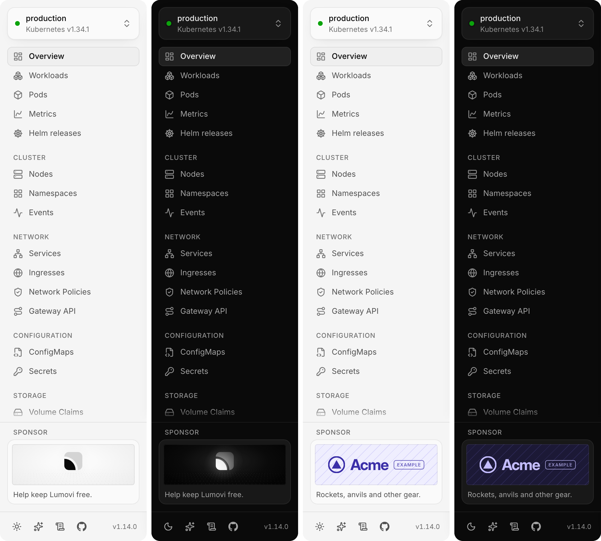

The app has one sponsor slot: a card at the bottom of the sidebar, above the footer, in the
desktop app, the server's web UI and the fleet hub. `sponsor.json` in
[Lumovi/main-sponsor](https://github.com/Lumovi/main-sponsor) says what it shows, so it changes
without a release:

- **None:** nothing. The sidebar is as it's always been.
- **Lumovi's own card**, built into the app, with no remote picture: the brand's scene, and
  "Help keep Lumovi free.", leading to Lumovi's GitHub Sponsors page. It's the one at
  launch, and whenever a sponsor's can't be shown: no network, no file, anything in it invalid,
  or past its `until`. The slot is never empty or broken.
- **A sponsor's card:** their picture, in its version for the mode, one line, and their link.

It's made of the sidebar's own parts, so it reads as part of Lumovi, not as an ad: a label like
the nav's section labels, over a card like the cluster switcher. Lumovi's card and a sponsor's
are the same size, so one replaces the other without moving anything.

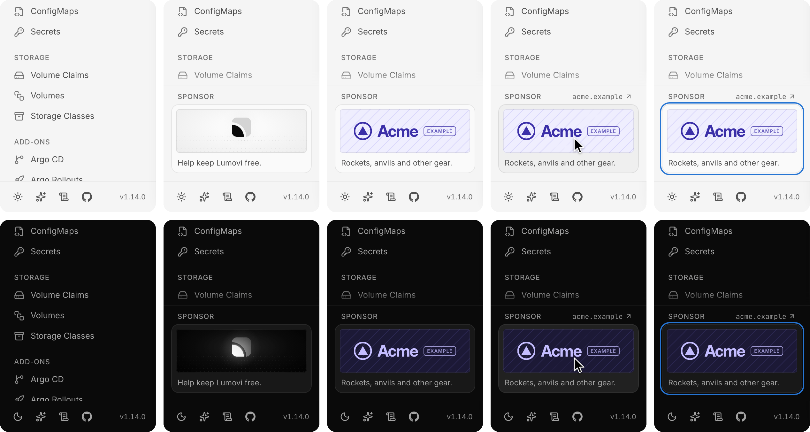

From the left: none, Lumovi's own, a sponsor's, on hover, and with keyboard focus.

- **Hover and focus.** The card's surface steps up, and the link's domain fades in beside the
  label, so people see where it leads before they click. It's the link's host, without `www.`;
  if it's too long, it's cut at the start, so the end, the part that says whose it is, always
  shows. Focus is the app's own ring, 2 px of Blue 600, and shows the domain too.
- **The link** is the whole card. The desktop app opens it in the browser, and the web UI in a
  new tab with `rel="noopener noreferrer"`, so the sponsor doesn't learn the server's address.
- **Screen readers** hear the section's name, the picture's `alt` and the line: "Sponsor, link,
  Acme, Rockets, anvils and other gear." The label row is hidden from them, since the section's
  name says it, and the domain is the link's description.
- **One card replaces another in place,** with the app's 160 ms fade, and only once the new
  picture has loaded and passed its checks. Nothing slides in.
- **Animated pictures** play once when the card appears, for 5 seconds at most, then rest on
  their last frame. For people who ask for reduced motion, the card shows the first frame, still,
  and doesn't fade.

### A long nav, and short windows

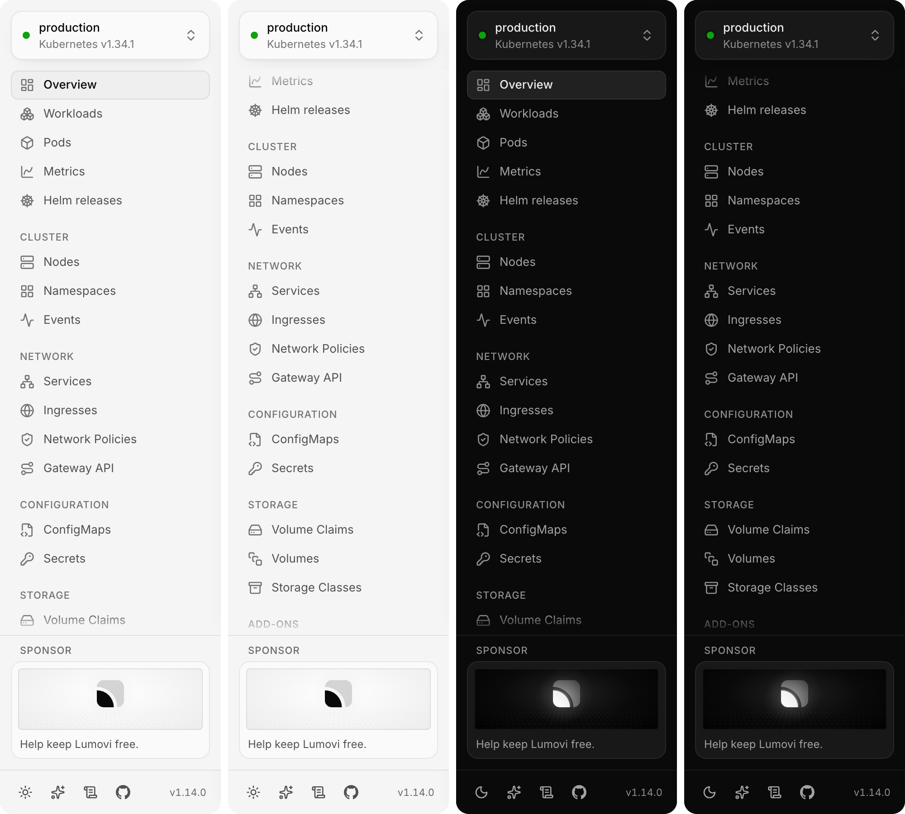

- **The card is pinned above the footer,** with a 1 px `--line` along its top as the footer has,
  so its label never reads as one more section of the nav.
- **When the nav is longer than its room,** it fades out over 24 px at each edge where it goes
  on: at the bottom until it's scrolled to the end, and at the top once it's scrolled. Above, from
  the left: light at rest and scrolled, then dark.
- **On short windows the card steps aside.** Under 720 px tall there's no card, and the nav
  keeps the room. At 720 px the nav still has about 405 px (with macOS's title bar); the desktop
  app is never under 640 px tall.

### Building it

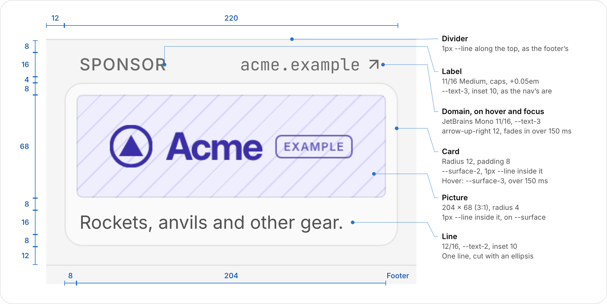

The card takes 149 px between the nav and the footer, outside the nav's scrolling. In the app's
Tailwind and tokens:

| Part           | Size      | Classes                                                                                                                                                                                                                              |
| -------------- | --------- | ------------------------------------------------------------------------------------------------------------------------------------------------------------------------------------------------------------------------------------ |
| The section    | 244 × 149 | `group shrink-0 border-t border-line px-3 pt-2 pb-3`, named "Sponsor" (`aria-label`); under 720 px tall, `[@media(max-height:719px)]:hidden`                                                                                         |
| Label          | 16 tall   | `mb-1 flex h-4 items-center px-2.5 text-2xs font-medium tracking-wider text-ink-3 uppercase`                                                                                                                                         |
| Domain         | 11/16     | `ml-auto flex min-w-0 items-center gap-[3px] font-mono font-normal tracking-normal normal-case opacity-0 transition-opacity group-hover:opacity-100 group-has-[:focus-visible]:opacity-100`, and Lucide's `ArrowUpRight` at `size-3` |
| Card, the link | 220 × 108 | `block rounded-xl bg-surface-2 p-2 shadow-[inset_0_0_0_1px_var(--line)] transition-colors hover:bg-surface-3`                                                                                                                        |
| Picture        | 204 × 68  | `relative block overflow-hidden rounded bg-surface`, with a 1 px `--line` inside it (`after:absolute after:inset-0 after:rounded after:shadow-[inset_0_0_0_1px_var(--line)]`), and ``                   |
| Line           | 200 wide  | `block truncate px-0.5 pt-2 text-xs text-ink-2`                                                                                                                                                                                      |
| The nav's fade | 24 px     | `mask-image: linear-gradient(to bottom, transparent, #000 24px, #000 calc(100% - 24px), transparent)`, each end only while the list goes on past it                                                                                  |

Hover and focus change over 150 ms (`duration-150`). The numbers are in
[`src/sponsor.ts`](../src/sponsor.ts). Lumovi's own pictures are in
[`media/sponsor/`](../media/sponsor) (`lumovi-light.png` and `lumovi-dark.png`, 408 × 136,
shown at half that), with a placeholder sponsor's (`example-*.png`) for tests.

### What sponsors send

[`media/sponsor/README.md`](../media/sponsor/README.md) is the spec, ready to be Lumovi/main-sponsor's
README, with a template: a picture for light mode and one for dark, 408 × 136 (3:1) exactly,
with logos and words inside the middle 360 × 88; PNG, WebP, GIF or animated WebP, up to 150 KB
still or 500 KB animated; a line of up to 32 characters; and an `https` link.

## The clusters page

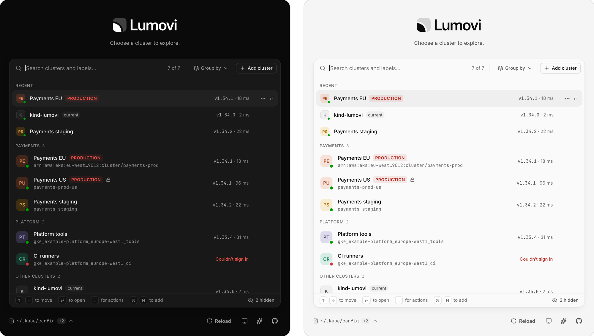

The desktop app's start screen is where people choose a cluster, choose the kubeconfig Lumovi
reads, add clusters and keep each one's settings. It stays the calm, keyboard-first list it was:
the search field has the focus, the list does the rest, and everything else is one step away, in
the list's bar, the page's footer, or a dialog.

Lumovi never writes a kubeconfig. Clusters added in Lumovi are kept in its own folder, and a
cluster's settings in its own settings, never in the file.

### The list

- **Rows** show what tells clusters apart. A tile in the cluster's color, with its letters, and
  its status dot on the tile's corner. Then its name, with a Production badge, a lock if it's
  read-only, and "current" for the kubeconfig's current context. Under the name, in mono, the
  context's name if the cluster has its own name, cut in the middle so its start and end show;
  otherwise its server and user. On the right, its version and latency, or what went wrong.
- **The selected row** steps up to `--surface-3`, and only it shows ⋯ and ↵ (`--text-3`, 4.6:1
  on it in light and 5.0:1 in dark). There's no colored bar: the step, and the row's own
  controls, are enough.
- **Recent** comes first: up to three clusters, one line each, as shortcuts. They stay in their
  groups too, so no group looks incomplete. Searching hides Recent.
- **Groups** are Lumovi's own (a cluster has one), in name order, then "Other clusters". **Group
  by** can also group by a label's values, in mono headings like `env=production`, or not group.
- **Labels** aren't on the rows, which keeps the list calm. Search finds them (`env=production`
  is a search), and a row shows the label a search matched, in blue.
- **Colors** are the eight data colors (`--series-1` to `--series-8`), in their order, or none: a
  gray tile. The tile is the color at 16% (22% in dark), and its letters the color mixed toward
  the text.
- **Hidden clusters** are left out, and the list's footer counts them. Shown, they're dimmed,
  with an eye.

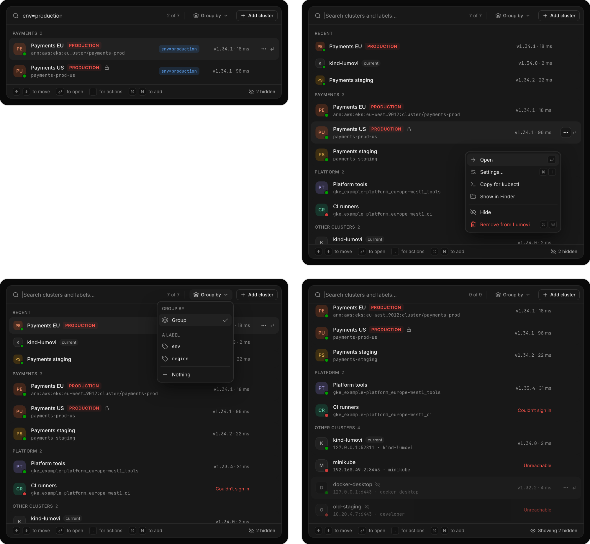

From the left: a search for a label, a cluster's actions, Group by, and hidden clusters shown.

### Kubeconfig files

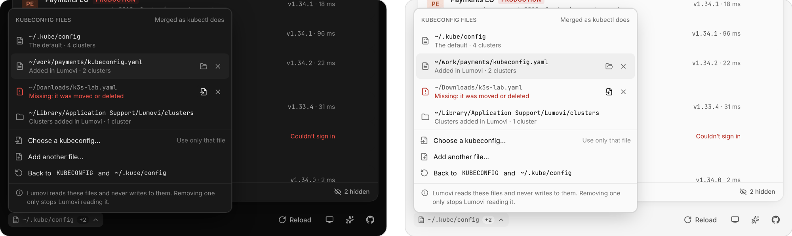

The footer's "Loaded from" becomes a button: the first file, a count of the others, and a
chevron. It opens the files Lumovi reads, merged as kubectl merges them:

- Each file says **where it comes from**: "The default" (`~/.kube/config`), "From KUBECONFIG",
  "Added in Lumovi", or "Clusters added in Lumovi" for Lumovi's own folder. On hover or focus, a
  file shows **Show in Finder**, and **Remove** if it was added in Lumovi; KUBECONFIG's own files
  can't be removed from here.
- **A file that's gone** is in red, with **Choose it again…** and Remove.
- **Choose a kubeconfig…** reads only the file chosen; **Add another file…** adds one to those
  read; **Back to KUBECONFIG and ~/.kube/config** undoes both.

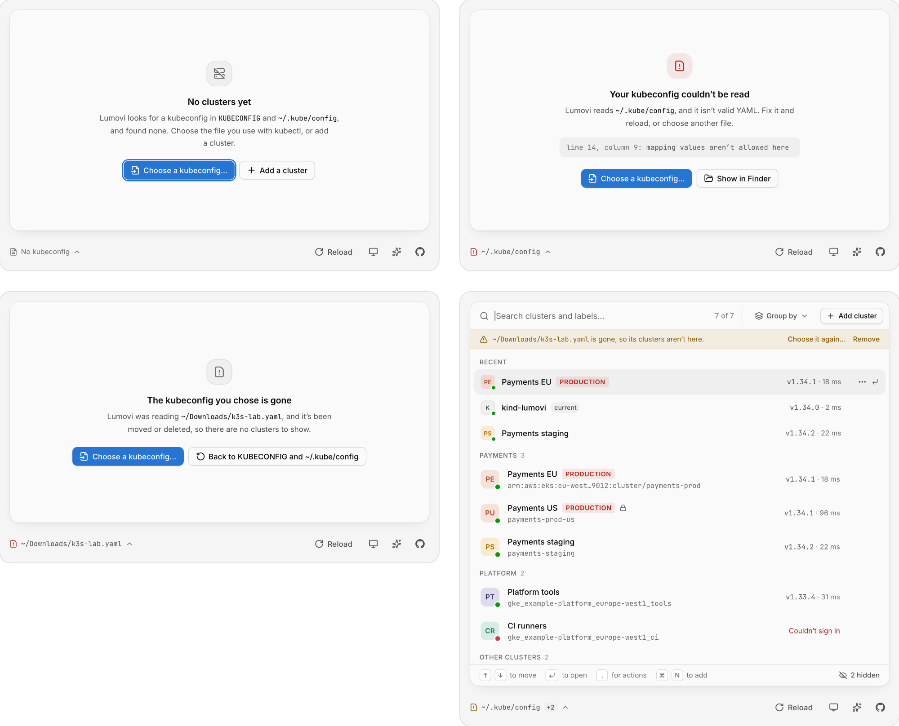

When nothing can be read, the list's panel says why, and every case offers **Choose a
kubeconfig…**, with the focus on it: no clusters, an unreadable file (with the parser's own
words), and a chosen file that's gone. When one file of several is gone or unreadable, the others
still load, under a notice in the list.

### Adding a cluster

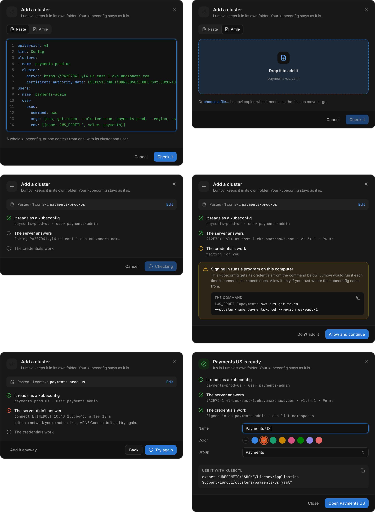

**Add cluster** (in the list's bar, or ⌘N) opens a dialog. Paste a kubeconfig, or one context
from one, or drop a file. **Check it** then checks three things, one after another, and says what
it found: it reads as a kubeconfig, the server answers (its version and latency), and the
credentials work (who Lumovi signed in as).

- **A credential plugin** (an `exec` user) runs a program on this computer, so the check stops
  before it and shows the exact command, with its environment, in a warning. Nothing runs until
  **Allow and continue**.
- **A check that fails** says why, in the error's own words, and what to try. **Add it anyway**
  keeps a cluster whose server didn't answer, as one behind a VPN that's off.
- **Done**, the cluster is in Lumovi's own folder. The dialog offers its name, color and group,
  and the line that uses it with kubectl:
  `export KUBECONFIG="$HOME/Library/Application Support/Lumovi/clusters/<name>.yaml"`. The new
  row lands selected in its group, tinted blue for a moment.

### A cluster's settings

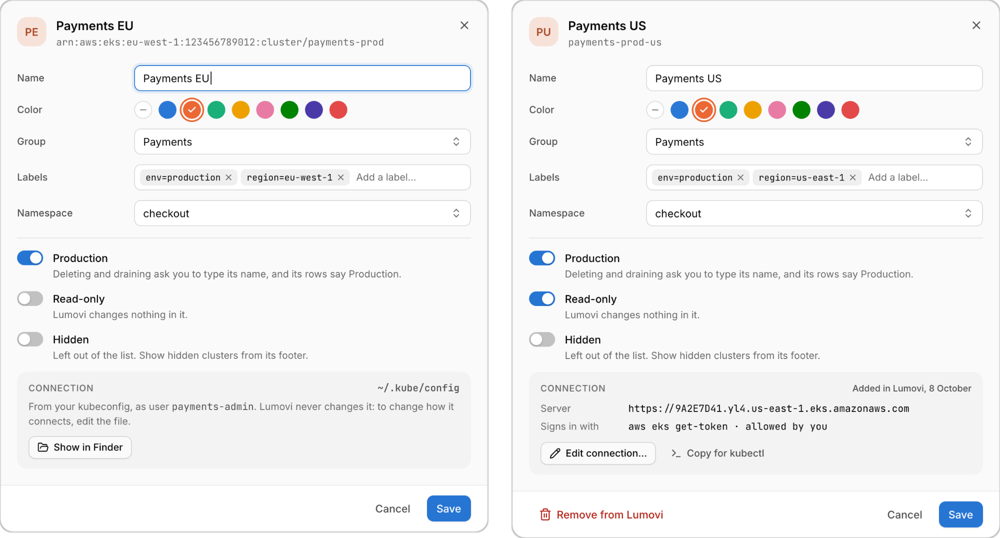

⌘I, or Settings… in a cluster's actions: name, color, group, labels, the namespace it opens in,
and three switches. **Production** makes deleting and draining ask for its name, and shows its
badge; it's set by hand, and starts as Lumovi's guess from the name. **Read-only** and **Hidden**
are as they say. **Connection** shows where the cluster comes from: a kubeconfig's can't be edited
here (Show in Finder); one added in Lumovi has **Edit connection…** (the add dialog again, with
its kubeconfig), **Copy for kubectl**, and **Remove from Lumovi**. Changes apply on **Save**.

### When an organization manages it

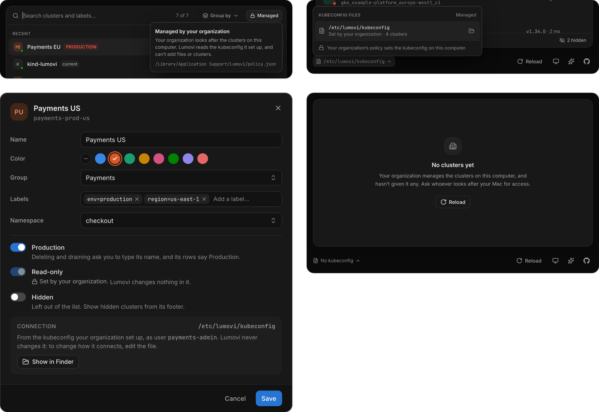

When an organization's policy sets the kubeconfig, **Add cluster** gives way to a **Managed**
badge, like the app's Read-only badge, whose popover says why and names the policy's file. The
files popover lists the managed file without changes. A setting the policy fixes, such as
Read-only, is locked and says "Set by your organization." A managed computer with no clusters
says who to ask.

### Motion, keys and words

- **Motion:** the header and the list rise in (320 ms, 60 ms apart), as today. Menus and popovers
  pop in from their button (160 ms); dialogs pop in over a dimmed, blurred page (160 ms). In the
  check, each step starts 80 ms after the last, and its spinner becomes a check with the toasts'
  quarter turn (500 ms). A new row's blue fades over 1.2 s. With reduced motion, all of it is
  instant.
- **Keys:** ↑ ↓ move, ↵ opens, `.` opens the selected cluster's actions, ⌘I its settings, ⌘N adds
  a cluster, ⌘⌫ removes one Lumovi added. The list's footer shows the first four.
- **Focus:** buttons and swatches get the app's 2 px Blue 600 ring; fields a blue border and a
  soft ring. On a page with nothing found, "Choose a kubeconfig…" has the focus.
- **Words:** "Choose a cluster to explore." "Search clusters and labels…" "Add cluster".
  "Kubeconfig files" "Merged as kubectl does". "Lumovi reads these files and never writes to
  them. Removing one only stops Lumovi reading it." "No clusters yet". "Signing in runs a program
  on this computer". The rest are in the mockups' source.

### Building it

In the app's Tailwind and tokens. The list keeps the start screen's cmdk picker and its classes,
except where this says otherwise; the column is `max-w-[720px]`.

| Part                     | Size       | Classes                                                                                                                                                                                                                                                                                                                                                                                                                                                                                          |
| ------------------------ | ---------- | ------------------------------------------------------------------------------------------------------------------------------------------------------------------------------------------------------------------------------------------------------------------------------------------------------------------------------------------------------------------------------------------------------------------------------------------------------------------------------------------------ |
| The list's bar           | 48 tall    | `flex h-12 items-center gap-2.5 border-b border-line pr-2.5 pl-4`; count `text-xs text-ink-3 tabular-nums`; then `h-5 w-px bg-line`                                                                                                                                                                                                                                                                                                                                                              |
| Group by, Add cluster    | 28 tall    | ghost and secondary buttons with `h-7 px-2.5 text-xs`, icons `size-3.5` (`Layers`, `Plus`); Group by is `bg-surface-3 text-ink-1` while it groups by a label                                                                                                                                                                                                                                                                                                                                     |
| Group heading            | 16 tall    | the picker's heading classes, then the count: `ml-1.5 font-normal tracking-normal tabular-nums opacity-75`; a label's value adds `font-mono normal-case tracking-normal`                                                                                                                                                                                                                                                                                                                         |
| Row                      | 56 tall    | `flex items-center gap-3.5 rounded-xl px-3 py-2.5`; selected `data-[selected=true]:bg-surface-3`, with no inset bar                                                                                                                                                                                                                                                                                                                                                                              |
| Recent row               | 40 tall    | `gap-3 py-2`, a 24 px tile (`size-6 rounded-[7px] text-[10px]`, its dot `size-2.5`), and no second line                                                                                                                                                                                                                                                                                                                                                                                          |
| Tile                     | 32 × 32    | `relative grid size-8 shrink-0 place-items-center rounded-[9px] text-xs font-semibold`; background `color-mix(in srgb, var(--series-N) 16%, transparent)` (22% in dark), letters `color-mix(in srgb, var(--series-N), black 28%)` (`white 30%` in dark)                                                                                                                                                                                                                                          |
| No color                 | 32 × 32    | `bg-surface-3 text-ink-2 ring-1 ring-inset ring-line`; on the selected row, `bg-surface-2`                                                                                                                                                                                                                                                                                                                                                                                                       |
| Status dot               | 12 × 12    | `absolute -right-[3px] -bottom-[3px] size-3 rounded-full border-2` in the row's background (`border-surface-2`, selected `border-surface-3`), with the health's `bg-*`                                                                                                                                                                                                                                                                                                                           |
| Name, badges             | 13.5 / 20  | name as today; Production `rounded bg-critical/10 px-1.5 py-px text-2xs font-semibold tracking-wide text-critical-text uppercase`; read-only `Lock` `size-3 text-ink-3`; hidden `EyeOff` `size-3.5`, row `opacity-55`                                                                                                                                                                                                                                                                            |
| Second line              | 12 / 16    | `mt-0.5 block truncate font-mono text-xs text-ink-3`; a context over 46 characters is cut in the middle                                                                                                                                                                                                                                                                                                                                                                                          |
| A matched label          | 20 tall    | `h-5 rounded-md bg-accent-soft px-1.5 font-mono text-2xs text-accent-strong`                                                                                                                                                                                                                                                                                                                                                                                                                     |
| Version and latency      | 116 wide   | `w-[116px] shrink-0 text-right text-xs text-ink-3`, the version `font-mono text-ink-2`                                                                                                                                                                                                                                                                                                                                                                                                           |
| ⋯ and ↵                  | 28, 20     | an `IconButton` at `size-7` with `Ellipsis`, then the ↵; both `opacity-0 group-data-[selected=true]:opacity-100`                                                                                                                                                                                                                                                                                                                                                                                 |
| The list's footer        | 36 tall    | as today, adding `.` for actions and ⌘N to add; on the right `ml-auto flex items-center gap-1.5 text-xs font-medium text-ink-2`, `EyeOff` or `Eye` `size-3.5`: "2 hidden", "Showing 2 hidden"                                                                                                                                                                                                                                                                                                    |
| Files button             | 28 tall    | `-ml-2 flex h-7 min-w-0 items-center gap-1.5 rounded-lg px-2 text-ink-3 hover:bg-surface-3 data-[state=open]:bg-surface-3`; path `truncate font-mono text-xs text-ink-2 [direction:rtl]`, count `rounded-full bg-surface-3 px-1.5 text-2xs font-medium text-ink-2`, `ChevronUp` `size-3.5`                                                                                                                                                                                                       |
| Files popover            | 440 wide   | `menuContent w-[440px] p-0`, `side="top" align="start"`; heading `flex items-baseline justify-between px-3.5 pt-3 pb-1.5`; a file `mx-1 flex items-center gap-2.5 rounded-lg px-2.5 py-2 hover:bg-surface-3`, path `truncate font-mono text-xs text-ink-1`, note `text-xs text-ink-3` (gone: `text-critical-text`), its buttons `size-[26px] rounded-md`; the items `border-t border-line p-1` with `menuItem`; the note `flex gap-2 border-t border-line px-3.5 pt-2.5 pb-3 text-xs text-ink-3` |
| A file gone, in the list | 32 tall    | `StaleNotice`'s classes, with `TriangleAlert` `size-3.5` and its two actions `ml-auto flex gap-3 font-medium`                                                                                                                                                                                                                                                                                                                                                                                    |
| Nothing to show          | 380 tall   | `flex min-h-[380px] flex-col justify-center rounded-2xl border border-line bg-surface-2 shadow-panel` (`min-h-[320px]` under 800 tall), holding `EmptyState` at `max-w-[460px]`, buttons `mt-5 flex gap-2`; unreadable uses `ErrorState`'s tile                                                                                                                                                                                                                                                  |
| Add, settings dialogs    | 600 wide   | `ActionDialog`, `w-[600px]`; settings at `top-[7vh]`                                                                                                                                                                                                                                                                                                                                                                                                                                             |
| Paste or a file          |            | `Segmented`; the editor is `CodeEditor` in `rounded-lg border border-line-strong bg-surface`, with the field focus ring; the drop zone `flex flex-col items-center gap-1.5 rounded-xl border-[1.5px] border-dashed border-line-strong px-5 py-10`, over it `border-accent bg-accent-soft`                                                                                                                                                                                                        |
| What was pasted          | 36 tall    | `flex items-center gap-2.5 rounded-lg bg-surface-3 px-3 py-2 text-xs text-ink-2`, and Edit `ml-auto font-medium text-accent-strong`                                                                                                                                                                                                                                                                                                                                                              |
| A check                  |            | `flex gap-2.5`; icons `size-4`: `CircleCheck` `text-good-text`, `CircleX` `text-critical-text`, `CircleAlert` `text-warn-text`, `LoaderCircle` `animate-spin text-ink-3`, `CircleDashed` `text-ink-3`; title `text-[13px] font-medium`, detail `truncate font-mono text-xs text-ink-3`, hint `mt-0.5 text-xs text-ink-2`                                                                                                                                                                         |
| The plugin warning       |            | `rounded-xl border border-warn/30 bg-warn/9 px-3.5 py-3`, `TriangleAlert` `size-4 text-warn-text`; the command `mt-2.5 ml-[26px] rounded-lg bg-surface px-3 py-2.5 shadow-[inset_0_0_0_1px_var(--line)]`, labelled as the Equivalent command box is, its environment `text-ink-3`, each argument kept whole                                                                                                                                                                                      |
| Use it with kubectl      |            | the Equivalent command box                                                                                                                                                                                                                                                                                                                                                                                                                                                                       |
| Settings form            | 128 + rest | `grid grid-cols-[128px_1fr] items-center gap-x-4 gap-y-3`; labels `text-xs font-medium text-ink-2`; fields the standard `field` (`h-8`), Group and Namespace with `ChevronsUpDown`                                                                                                                                                                                                                                                                                                               |
| Labels field             | 32 tall    | `flex min-h-8 flex-wrap items-center gap-1 px-1.5 py-1`, a label `h-5 rounded-md bg-surface-3 pr-1 pl-1.5 font-mono text-2xs text-ink-1` with `X` `size-3`                                                                                                                                                                                                                                                                                                                                       |
| Swatches                 | 22 × 22    | `size-[22px] rounded-full`, chosen `ring-2 ring-offset-2 ring-offset-surface-2` in its color, with `Check` `size-3` in white; none `bg-surface ring-1 ring-inset ring-line-strong` with `Minus`                                                                                                                                                                                                                                                                                                  |
| Switches                 |            | `flex items-start gap-3`, `Switch`, title `text-[13px] font-medium`, line `text-xs text-ink-3`; locked: `Switch` disabled and `inline-flex items-center gap-1 text-ink-2`, `Lock` `size-3`, "Set by your organization."                                                                                                                                                                                                                                                                          |
| Connection               |            | `rounded-xl bg-surface-3/70 px-3.5 py-3`; its label row as the Equivalent command box's, the source `ml-auto font-mono text-xs text-ink-2`; details `grid grid-cols-[96px_1fr] gap-x-3 gap-y-1 text-xs`                                                                                                                                                                                                                                                                                          |
| Managed                  | 28 tall    | the Read-only badge's classes, reading "Managed"; its popover `menuContent w-[340px] p-3`                                                                                                                                                                                                                                                                                                                                                                                                        |

The tile's colors need `--series-3` to `--series-8` in the app's `@theme`, beside the two it has.
The mockups are drawn from [`src/clusters.ts`](../src/clusters.ts), with the app's own icons
([`src/lucide.ts`](../src/lucide.ts)).

### On lumovi.dev

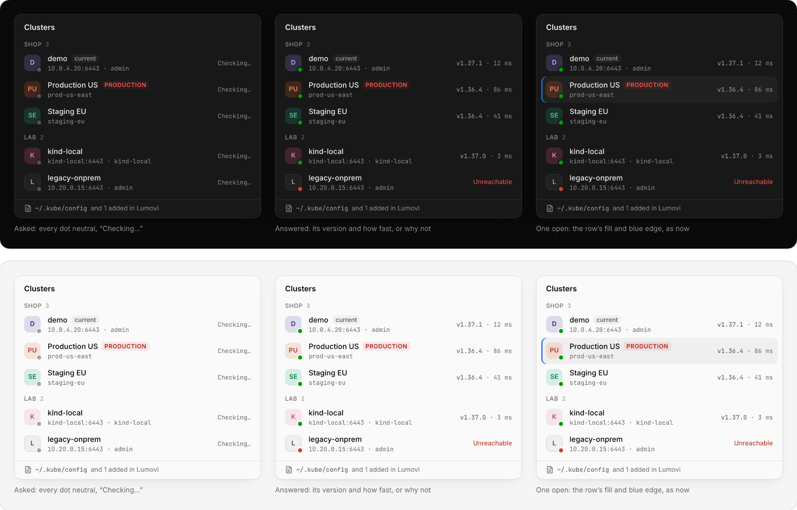

The website's "Every cluster" scene has a card beside its plates: the clusters page, small. It
shows what the page adds: a tile in the cluster's color with its letters and its status in the
corner, a name of its own with the context under it, groups, the Production mark, and a footer
that says where the clusters come from, with the one added in Lumovi counted apart.

- **Parts are the page's, at nine tenths:** the tile 28 px with an 8 px radius and 11 px letters,
  its dot 11 px with a 2 px ring in the row's color; the name 12.5 px, the line under it and
  the answer in mono at 10.5 px; a group's heading 10 px, uppercase, with its count.
- **A named cluster says its context under its name;** an unnamed one, its server and who signs
  in. A cluster with no color has the plain tile.
- **The dot is neutral while a cluster is asked,** green once it answers, red when it doesn't;
  the answer is "Checking…", then the version and the time, or "Unreachable" in the critical
  text color, in the sans face.
- **The open cluster's row** keeps the card's own mark: a fill and a 2 px blue edge on its left.
- **The footer is words, with no plus:** "~/.kube/config and 1 added in Lumovi". A plus before
  words is Add cluster's.
- **No cluster is blue here.** Blue is one of the page's eight colors, but on this card it's the
  open row's edge alone.
- **No loopback addresses, and no real cluster's name.**

It's drawn from [`src/site.ts`](../src/site.ts), with the site's five clusters.

### Daylight, on lumovi.dev

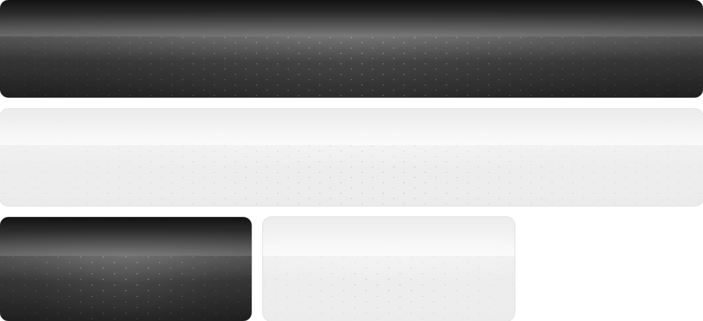

The website's sponsor tiers each have a light: a spark, a glow, a beam, the lighthouse (the
mark). The fifth, Daylight, is the step beyond a lamp: there is no source in the picture. The
floor of dots runs to the card's edges, a horizon crosses the card, and the sky above it is
brightest where it meets the floor.

- **It's the only light that fills its card,** and it lies across the top of the tier's wide
  card, as the other four lie on theirs. Under 900 px the card stacks and the light keeps the
  others' height.
- **White only, as the other lights:** adding up on graphite, and over the light theme's gray
  at 2.4 times the strength. No new color.
- **On light, the floor stays gray.** It's lit at a fifth of the sky's strength there: lit
  alike, the horizon would be white on white. The sky ends on the floor, and that edge is the
  picture.
- **Its numbers,** in the scene's units (k pixels to a unit): the horizon 0.95 above the floor's
  middle; the sky from nothing at the top to white at 30% at the horizon; a glow along the horizon as wide as the card and 1.1 units tall, at 14%, falling off evenly, so the horizon is brightest at its middle with no spot that reads as a lamp; the floor's white from 18% at the
  horizon to 3% at the foot; the dots reach 80% of the card's width from its middle and stop at
  the horizon.
- **Under the pointer** the horizon's glow brightens, as the other lights do; nothing moves.

It's drawn from [`src/daylight.ts`](../src/daylight.ts), with the numbers the website's scene
takes.

## The Fleet page

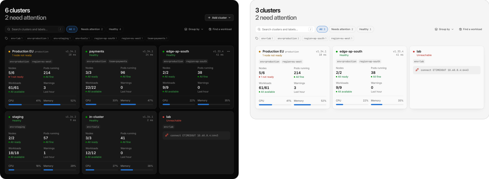

The server's Fleet page gains what an admin needs to manage the fleet from it: connecting a
private cluster, a cluster's settings, and, where the server allows it, adding one by kubeconfig
or token. Everyone else sees the page as it was, with nothing new to click. Every change is an
admin's, and goes in the audit log; each dialog says so in its footer.

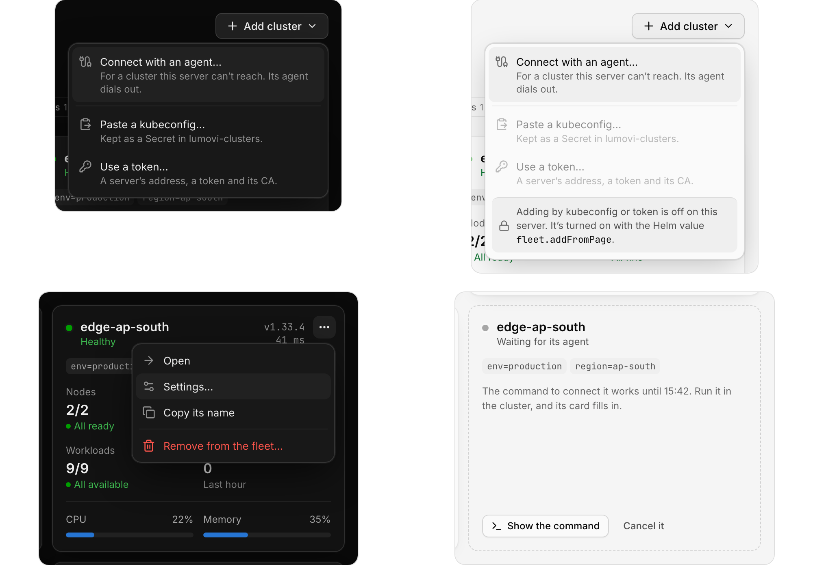

- **Add cluster** sits beside the title, and opens a menu. **Connect with an agent…** comes
  first: it's the way that puts no credentials in the hub. **Paste a kubeconfig…** and **Use a
  token…** follow; where the server doesn't allow them (`fleet.addFromPage`), they're shown
  disabled, with the Helm value that turns them on.
- **A card's ⋯** shows on hover or focus, beside the version, so the cards stay as they are:
  Open, Settings…, Copy its name, and **Remove from the fleet…** for clusters added from the page.

### Connecting a private cluster

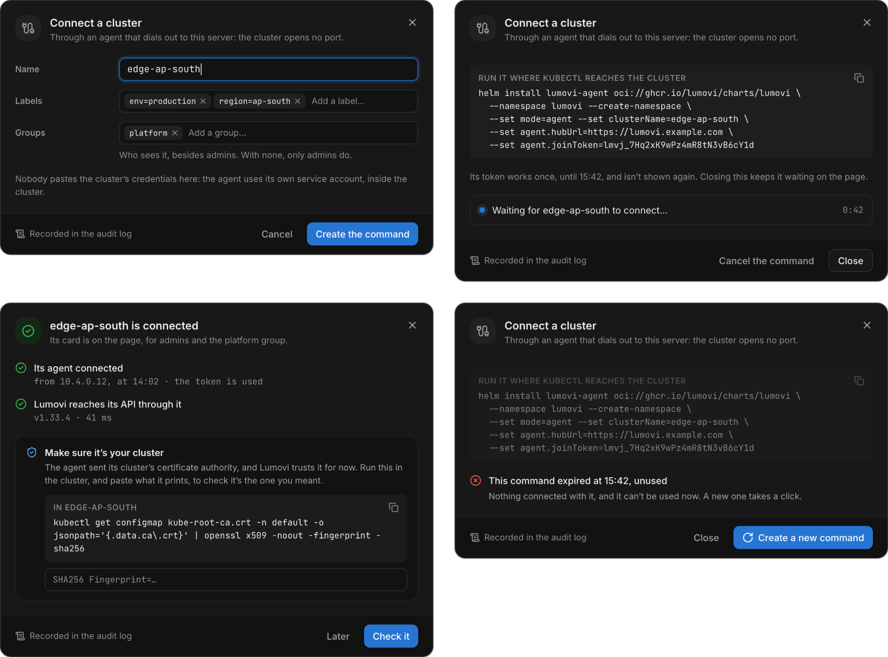

The cluster's agent dials out to the hub, so the cluster opens no port, and nobody pastes its
credentials into the hub.

- **First, what the fleet calls it,** its labels, and its groups: who sees it, besides admins.
- **Then one command,** `helm install … mode=agent`, with copy. Its token works once, for an
  hour, and isn't shown again. The dialog waits, with a timer. Closed, it leaves a dashed card on
  the page, which waits too, with **Show the command** and **Cancel it**.
- **Connected,** its card lands in place, tinted blue for a moment, and the dialog asks for the
  last step: checking the cluster's certificate authority, with the command that prints its
  fingerprint. **Later** leaves it to the page's "Agents to check" notice.
- **An expired command, or a used one,** says what happened, and offers a new one. A second
  agent with a used token is refused, and the dialog says when.

### A cluster's settings

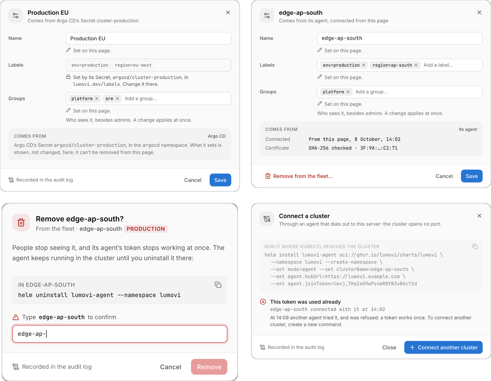

Name, labels and groups, from a card's ⋯. **Each field says where its value comes from.** One
the cluster's source sets (a Secret's `lumovi.dev/*` annotation, or the kubeconfig's
`lumovi.dev` extension) is locked, and says which and where to change it; the page never
overrides it. One the source leaves unset can be set here, and once it is, says so; an empty one
shows no source line. **Groups** decide who sees
the cluster, and a change applies at once. **Comes from** names the source; for a cluster
connected from the page, when, and its checked certificate authority. **Removing** asks for the
cluster's name, says what stops, and gives the command that uninstalls its agent.

### Adding by kubeconfig or token

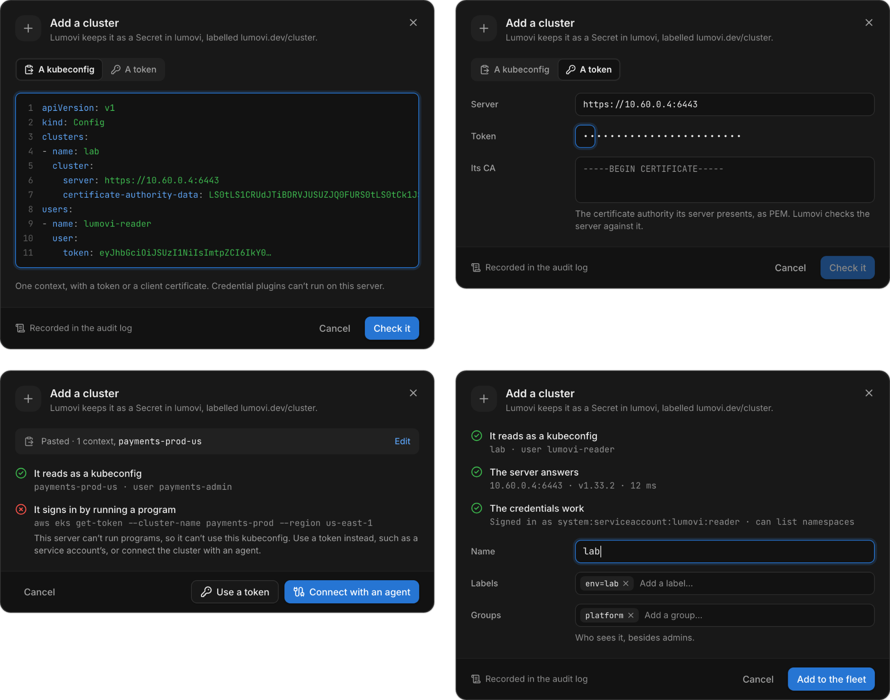

Only where the server allows it. Lumovi keeps the cluster as a Secret, labelled
`lumovi.dev/cluster`, in a namespace of its own (`<release namespace>-clusters`, the Helm value
`fleet.addNamespace`), so the hub's write access reaches nothing else. The checks are the clusters page's. **A credential plugin is
refused,** not asked about, since the hub can't run programs: the dialog shows the command,
says why, and offers what works instead, a token or an agent.

### Building it

The page, its cards and its menus keep their classes; dialogs, menus, fields, checks and command
boxes are the clusters page's (see its build table). What's new:

| Part                 | Size     | Classes                                                                                                                                                                                                                                                                          |
| -------------------- | -------- | -------------------------------------------------------------------------------------------------------------------------------------------------------------------------------------------------------------------------------------------------------------------------------- |
| Title row            |          | `flex items-end gap-4`: the `h1`, then Add cluster, a secondary button with `Plus` and `ChevronDown`, for admins only                                                                                                                                                            |
| Add cluster's menu   | 320 wide | `menuContent w-80`, `align="end"`; items `menuItem h-auto items-start py-2 whitespace-normal`, with a second line `block text-xs text-ink-3`; disabled `data-[disabled]:opacity-45`; the note `m-1 flex gap-2 rounded-lg bg-surface-3 p-2 text-xs text-ink-2`, `Lock` `size-3.5` |
| A card's ⋯           | 28 × 28  | an `IconButton` at `size-7`, `-mt-1 -mr-1.5`, after the version, `opacity-0 group-hover:opacity-100 group-focus-within:opacity-100`; outside the card's link, so it isn't a link inside a link                                                                                   |
| A waiting card       |          | `rounded-xl border-[1.5px] border-dashed border-line-strong p-4`, no fill; its dot `bg-neutral animate-pulse-dot`, status `text-neutral-text` (waiting is in progress: neutral, as statuses are); buttons `mt-auto` (`h-7 text-xs`)                                              |
| A new card           |          | for 1.2 s, `border-accent/45 bg-[color-mix(in_srgb,var(--accent)_6%,var(--surface-2))]`, fading to its own                                                                                                                                                                       |
| Waiting              | 40 tall  | `flex items-center gap-2.5 rounded-[10px] border border-line px-3 py-2.5 text-[13px]`; the dot `size-2 rounded-full bg-neutral ring-4 ring-neutral/12`; the timer `ml-auto font-mono text-xs text-ink-3`                                                                         |
| Checking its CA      |          | `rounded-xl border border-line bg-surface px-3.5 py-3`, `ShieldCheck` `size-4 text-accent-strong`; the command box and the field `ml-[26px]`                                                                                                                                     |
| Where a value's from | 17 tall  | `mt-1.5 flex items-start gap-1.5 text-xs text-ink-3`, `Pencil` `size-3` ("Set on this page."); from its source `text-ink-2`, `Lock` `size-3`, its names in `font-mono`                                                                                                           |
| A locked field       | 32 tall  | the labels field, `bg-surface-2`, its labels `border border-line bg-transparent text-ink-2`, with no `X`                                                                                                                                                                         |
| Audit note           |          | `mr-auto flex items-center gap-1.5 text-xs text-ink-3`, `ScrollText` `size-3.5`: "Recorded in the audit log"                                                                                                                                                                     |

The command's values (`agent.joinToken`, the release's name) stand for what the agent's chart
defines. The mockups are drawn from [`src/fleet.ts`](../src/fleet.ts).

## On a phone

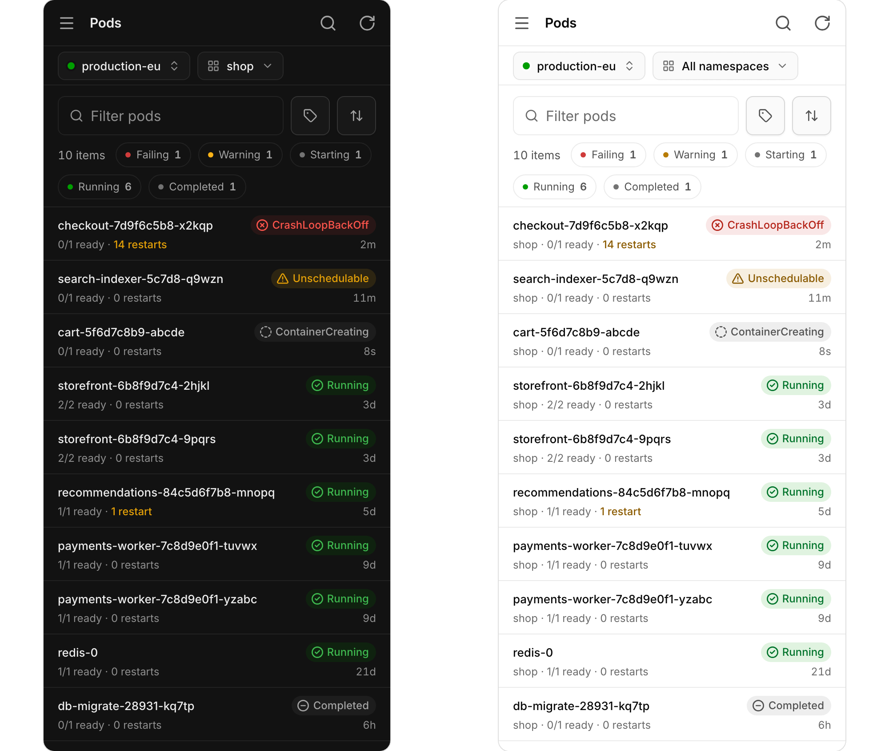

The server's web UI works in a browser on a phone and a tablet. The desktop app never gets this
small: its window stops at 1024 px, and from 1024 px nothing here applies. Narrower than that,
every screen is built from the same few parts, drawn here once, with the app's own type sizes,
colors and icons and nothing new.

- **Under 1024 px, the shell changes:** the sidebar becomes a **drawer**, and the header becomes
  a **top bar** with a **context row** under it, which says which cluster and which namespace
  you're looking at.
- **Under 640 px, the content changes too:** a list is **two-line rows**, a detail is a **page**
  with Back, and every menu, picker and dialog is a **sheet** from the bottom.
- **A finger gets 44 px, at any width.** What's tapped answers on at least 44 × 44 px wherever
  the pointer is coarse (`pointer: coarse`), and nothing is shown on hover only where there is
  no hover (`hover: none`). An iPad on its side is wider than 1024 px and still a finger, so
  this follows the pointer and not the width; a narrow window with a mouse keeps the desktop's
  sizes.
- **A field's text is 16 px under 640 px.** Below that, Safari on a phone zooms the page when a
  field takes focus. This goes for every field, select and text area.
- **Nothing scrolls sideways** except a strip of tabs.

### The list

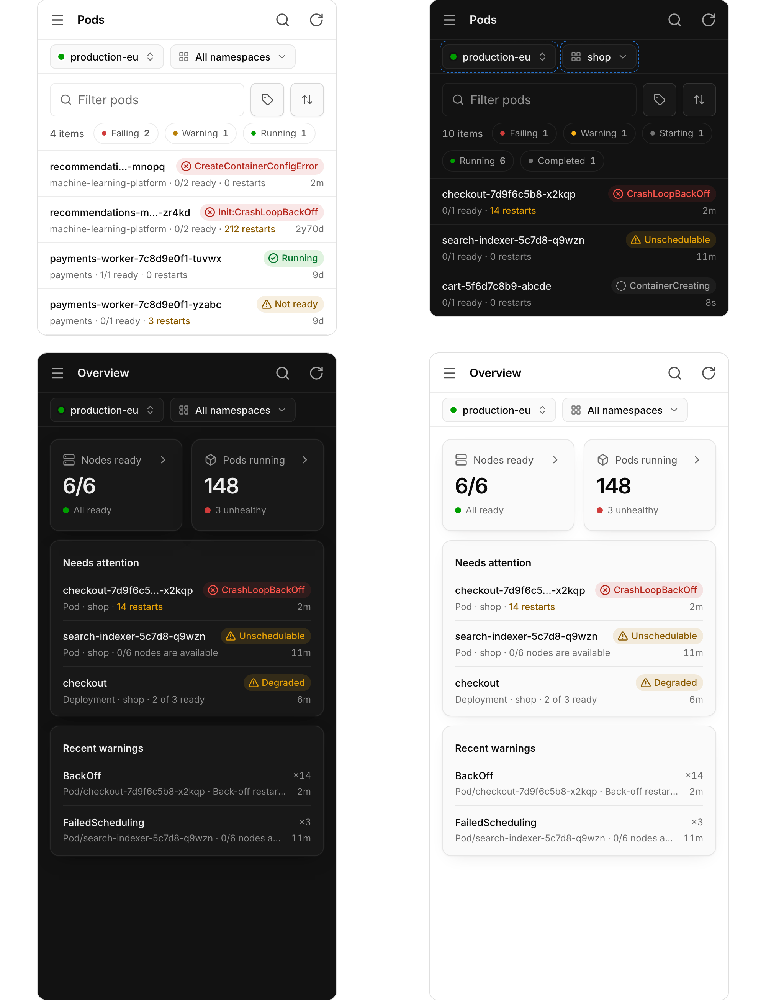

- **A row is 60 px high and two lines.** The first has the name, and its status at the right:
  the app's pill, unchanged, with its icon. A status is never a dot alone, and each keeps the
  level the app gives it. The second has what's worth knowing, from the kind's own columns in
  their order (a pod's ready count and restarts), and its age at the right.
- **A name gives way in the middle,** never at its end: replicas differ only in their last
  characters, so a name cut at its end makes two pods read the same. Its last six characters
  always show, and the ellipsis meets them with no gap: the head is cut to whole characters by
  measuring, since CSS's own ellipsis leaves up to a character of slack. The pill keeps its
  whole word up to 200 px; the name keeps at least 120 px.
- **Figures line up; names don't stretch.** Tabular figures go on the numbers alone (the count,
  a chip's number, the age), never on a line that holds a name or a message: they widen its
  hyphens too.
- **A row says its namespace only when every namespace is listed,** as the table does.
- **The toolbar is two rows.** A filter field with two buttons beside it, the label filter and
  Sort; then the count and the health chips, which wrap to a second line and never scroll.
  There's no header row, no checkboxes and no selection.
- **The overview's cards use the same row,** and its tiles stay two across, their chevrons
  always shown.

### The drawer

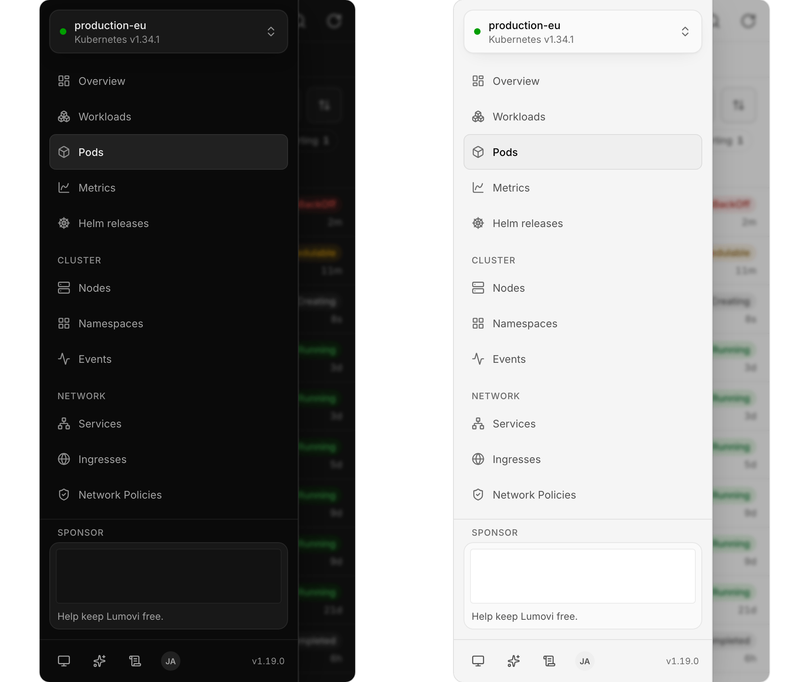

The sidebar as it is, from the left: the cluster switcher, the same items in the same order at
44 px, the sponsor card, and the footer's buttons. It's 320 px wide and always leaves 56 px of
the page showing. It closes when an item is chosen, on a tap outside it, and on Escape. Its
open edge has a hairline and the pop shadow, which is what sets it apart from the page in dark.

### Sheets

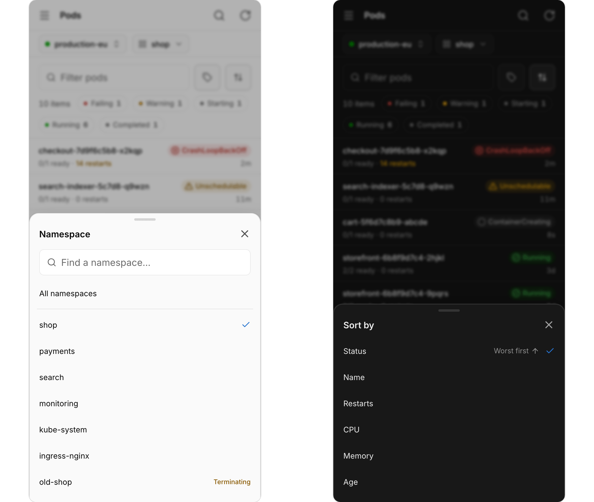

Under 640 px every menu and picker opens as a sheet: the namespace picker, the cluster switcher,
the theme, a row's actions, Sort.

- **It always has a title,** and a close button beside it. The grabber says it can be dragged
  down; the title says what it is.
- **Items are 44 px high.** The chosen one has the blue check at its right, as in the app's
  menus, and no fill: a fill is where the pointer is, and a finger has none until it presses.
- **It's at most 85% of the screen's height;** its list scrolls inside it, and it keeps clear of
  the home bar (`env(safe-area-inset-bottom)`).
- **Sort** lists the columns the table can sort by. The chosen one says its direction; choosing
  it again turns it around.

### A detail

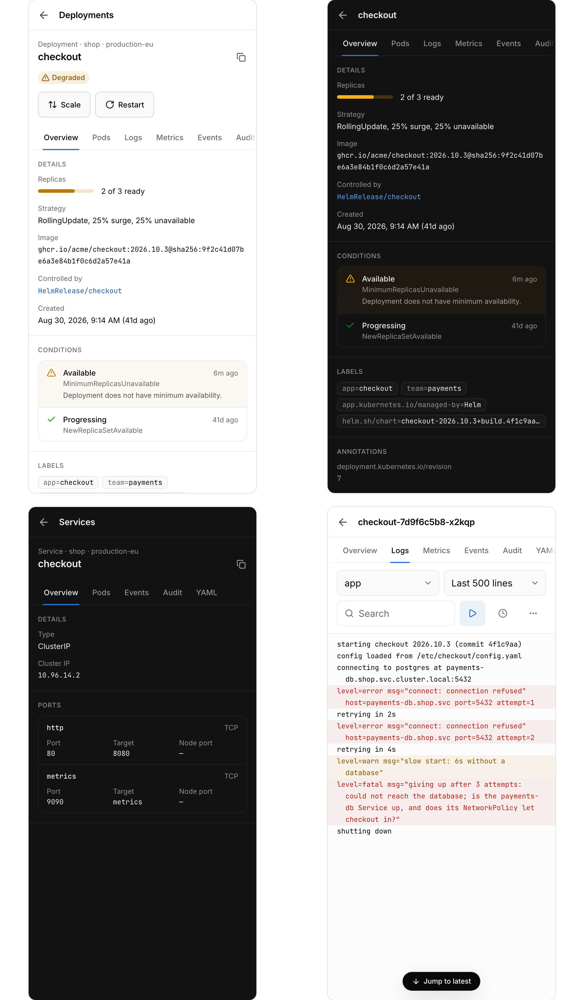

- **A detail is a page over the list,** with Back in the top bar. The top bar names the list it
  came from while the object's own header is on screen, and the object once that has scrolled
  away. The tabs stay under the top bar.
- **Its header says the cluster:** kind, namespace, cluster. That's where Restart and Scale are,
  and the context row isn't on this page. The age moves to the facts.
- **The status has a line of its own, and so do the actions,** at 44 px. A phone offers at most
  two actions for an object, so there is no ⋯ menu.
- **Facts stack:** a label, at 12 px, above its value. **A table becomes cards,** one for each
  row, its columns side by side under the row's name.
- **Wrapped text hangs.** Where a log line or a diff's line wraps, what follows is indented by
  two characters, so one long line doesn't read as two. A long value breaks anywhere, and never
  gets a hyphen it didn't have.

### An approval, and Lumovi's own dialogs

- **A dialog is a sheet** as tall as what it holds, to within 24 px of the top. Its header is
  the dialog's own; the cluster and the Production mark are never cut short, and wrap to a
  second line if they must.
- **The footer is pinned.** The wait has a line to itself, above the buttons. The quiet button,
  Reject… or Cancel, is at the left edge; the one that acts is at the right, at least 120 px
  wide; both are 44 px high, with the gap between them left empty.
- **Dragging the sheet down, or tapping outside it, puts the request aside:** it isn't Reject.
  The request waits, and its pill stays.
- **The footer stays above the keyboard** while a name is typed to confirm.

### On its side, and on a tablet

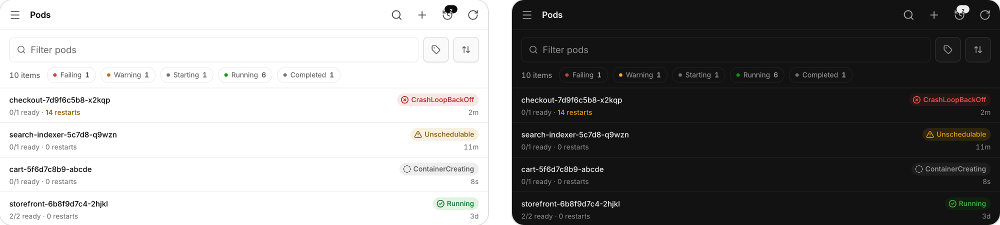

Under 500 px of height the context row scrolls away with the page, and the top bar stays.

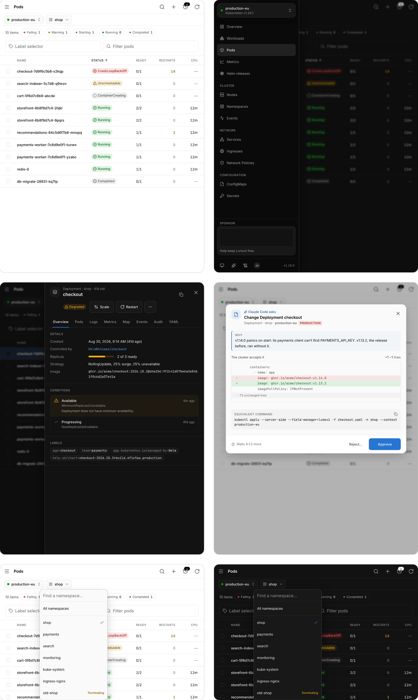

From 640 px the content is the desktop's: lists are tables that drop columns as they do now,
dialogs are dialogs, menus are popovers. Three things differ:

- **The shell is the phone's:** the top bar, with the header's own buttons, the context row and
  the drawer.
- **A detail is a panel from the right,** 600 px wide, over the list, which is dimmed behind it.
  Under 700 px it fills the screen.
- **On a touch screen, buttons and menu items are 44 px high.**

### Building it

Everything keeps its classes; what's listed is what a narrow screen adds. Sizes are in CSS pixels.

| Part                  | Size               | Classes                                                                                                                                                                                                                                                                                                                               |
| --------------------- | ------------------ | ------------------------------------------------------------------------------------------------------------------------------------------------------------------------------------------------------------------------------------------------------------------------------------------------------------------------------------- |
| The page              |                    | under 1024 px the content panel loses its margin, border and corners: `bg-surface`, edge to edge                                                                                                                                                                                                                                      |
| Top bar               | 52 tall            | `flex h-[52px] items-center border-b border-line bg-surface px-1`; the title `min-w-0 flex-1 px-1 text-[15px] leading-5 font-semibold tracking-[-0.01em]`                                                                                                                                                                             |
| A bar button          | 44 × 44            | `grid size-11 place-items-center rounded-lg text-ink-2`, icon `size-5`: `Menu` or `ArrowLeft`, then `Search` and `RotateCw` (from 640 px also `Plus`, the forwards and `History`)                                                                                                                                                     |
| Context row           | 44 tall            | `flex h-11 items-center gap-2 border-b border-line bg-surface px-4`                                                                                                                                                                                                                                                                   |
| A context chip        | 32 tall, 44 to tap | `flex h-8 min-w-0 items-center gap-2 rounded-lg border border-line bg-surface-2 px-2.5 text-[13px] font-medium`; the cluster's `max-w-[60%]`, with `StatusDot` and `ChevronsUpDown`; the namespace's with `LayoutGrid` and `ChevronDown`, icons `size-3.5 text-ink-3`; "Cluster-wide" has no border and can't be tapped               |
| A name                |                    | `flex min-w-0 whitespace-nowrap`: the head, cut to the characters that fit and ending in `…`, then the last six characters `shrink-0`; measured on resize, as the table measures its columns                                                                                                                                          |
| List toolbar          |                    | `border-b border-line px-4 pt-3`; row one `flex gap-2`; row two `flex min-h-11 flex-wrap items-center gap-2 py-2`: the count, then `HealthChips` as they are                                                                                                                                                                          |
| A field               | 44 tall            | `flex h-11 items-center gap-2 rounded-lg border border-line bg-surface px-3 text-base`, icon `size-4`; focus as now                                                                                                                                                                                                                   |
| A square button       | 44 × 44            | `grid size-11 place-items-center rounded-lg border border-line-strong bg-surface-2 text-ink-2 shadow-xs`, icon `size-4`: `Tag` (the label filter), `ArrowUpDown` (Sort)                                                                                                                                                               |
| A row                 | 60 tall            | `flex h-[60px] flex-col justify-center gap-[3px] border-b border-line px-4`, pressed `bg-surface-3/50`; line one `flex items-center gap-3`: the name `min-w-[120px] flex-1 font-medium`, then `StatusPill` at `max-w-[200px]`; line two `flex gap-3 text-xs text-ink-3`: the facts `flex-1 truncate`, the age `shrink-0 tabular-nums` |
| Drawer                | 320 wide           | `fixed inset-y-0 left-0 z-50 flex w-[min(320px,calc(100%-56px))] flex-col border-r border-line-strong bg-app shadow-pop`, over the dialogs' scrim; items `h-11`; the footer's buttons `size-11`                                                                                                                                       |
| Sheet                 | up to 85% tall     | `fixed inset-x-0 bottom-0 z-50 flex max-h-[85dvh] flex-col rounded-t-2xl border border-b-0 border-line-strong bg-surface-2 shadow-pop`, over the scrim; the grabber `mx-auto mt-2 h-1 w-9 rounded-full bg-line-strong`                                                                                                                |
| A sheet's title       | 44 tall            | `flex h-11 items-center pr-1 pl-4`; the title `flex-1 text-[15px] font-semibold`; Close, a bar button with `X`                                                                                                                                                                                                                        |
| A sheet's item        | 44 tall            | `menuItem h-11` in a list `px-2 pb-3`; the chosen one's `Check` `size-4 text-accent`; pressed `bg-surface-3`                                                                                                                                                                                                                          |
| A dialog, as a sheet  | from 24 px down    | the sheet, with `top-6` when it's taller than the screen; the dialog's header at `pt-2 pr-1 pl-4`, its meta line `flex-wrap`; the body `px-4 pt-4 pb-5`                                                                                                                                                                               |
| A dialog's footer     |                    | `border-t border-line bg-surface px-4 py-3`, plus the home bar's inset; the wait `mb-3 flex items-center gap-1.5 text-xs`; the buttons `flex items-center justify-between`, each `h-11 px-4`, the ghost one `-ml-4`, the other `min-w-[120px]`; no key hint                                                                           |
| A detail's header     |                    | `px-4 pt-4 pb-3`: the meta line; the name as now, with the copy button; the pill `mt-2.5`; the actions `mt-3 flex gap-2`, secondary buttons at `h-11 px-4`; no kind tile                                                                                                                                                              |
| Tabs                  | 44 tall            | the strip as it is, its tabs `h-11`, `px-4`, the faded edges 16 px                                                                                                                                                                                                                                                                    |
| A stacked fact        |                    | `flex flex-col gap-3`; the label `text-xs text-ink-3`, the value `mt-0.5 text-[13px] wrap-anywhere`                                                                                                                                                                                                                                   |
| A table, stacked      |                    | `divide-y divide-line overflow-hidden rounded-xl border border-line`; a row `px-3.5 py-2.5`: its name `font-mono text-xs font-medium`, then `grid grid-cols-3 gap-3 text-xs` as a container's resources are                                                                                                                           |
| Wrapped mono          |                    | `whitespace-pre-wrap wrap-anywhere`, with `pl-[calc(1rem+2ch)] -indent-[2ch]`; in the diff the indent also takes the sign's column and the line's own                                                                                                                                                                                 |
| Logs' controls        | 44 tall            | two selects side by side, `h-11 text-base`; then the search field and the toggles at `size-11`: Follow, Timestamps, and a ⋯ with the rest. Lines always wrap; timestamps start off                                                                                                                                                    |
| A detail, on a tablet | 600 wide           | `fixed inset-y-0 right-0 z-50 w-[min(600px,100%)] border-l border-line-strong bg-surface shadow-pop`, over the scrim; inside, the panel as it is                                                                                                                                                                                      |

The mockups are drawn from [`src/phone.ts`](../src/phone.ts), where `middle()` is the rule for
names.

## The menu on Windows and Linux

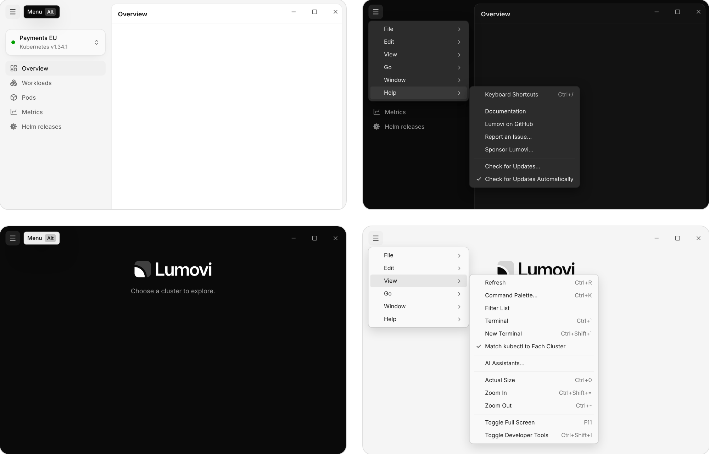

The desktop app's window hides its title bar, and with it Windows' and Linux's menu bar. So
the menu has a button where macOS keeps its traffic lights: the window's top left corner.

- **The button:** an `IconButton` with Lucide's `Menu`, named "Menu", its tooltip "Menu" with
  `Alt`. It's in the same place in every view: 12 px from the left, centered in the 52 px band
  Windows draws its window controls in (`TITLE_BAR_HEIGHT`), so it lines up with them. In a
  cluster, the sidebar's top band, which macOS keeps 40 px for its traffic lights
  (`traffic-lights h-10`), is 52 px on Windows and Linux (`h-[52px]`), with the button at its
  left (`flex items-center px-3`); the cluster sits 12 px lower than on a Mac. On the start
  screen it's at the left of the 52 px title bar (`titlebar-leading`, the button `ml-3`,
  centered). Its tooltip shows to its right, centered on it (`side="right"`), clear of the
  cluster. Open, it's `bg-surface-3 text-ink-1`, as any `IconButton` is.
- **The corner still drags the window.** Only the button is `no-drag`; the rest of the band
  around it stays a drag region, and double-clicking it maximizes the window, as before.
- **The menu is the app's own,** opened under the button with Electron's `Menu.popup()`. So its
  items, groups, labels, check marks, shortcuts and what an organization's policy locks are the
  macOS menu's, and can't drift: File, Edit, View, Go, Window and Help. The system draws it, and
  its edit, zoom and full-screen commands work as they would from a menu bar. On Windows it's in
  the app's theme (`nativeTheme.themeSource`); on Linux, in the desktop's own (GTK) theme, as
  every menu there is, so it can be light in a dark Lumovi.
- **Keys:** `Alt` pressed and released on its own, or `F10`, opens it, as a menu bar would.
- **Help → Documentation,** on every platform, comes first among Help's links, before Lumovi on
  GitHub.
- **macOS has no button:** its menu bar has all of it, and the corner is the traffic lights'.
- **Pages of their own** (AI assistants, the audit log) have it too, first in their header, at the
  same place; their header is 52 px above its border, on every system, so its row is on the
  window controls' line.

The picture is drawn from [`src/appmenu.ts`](../src/appmenu.ts), the menu as Windows 11 draws
it.

## Typography

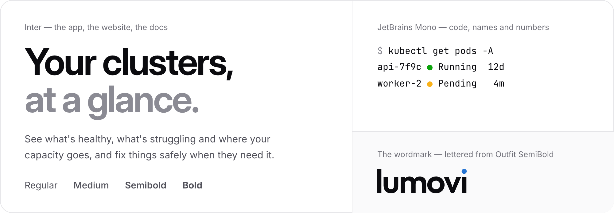

- **[Inter](https://rsms.me/inter/)** for everything you read, and the wordmark: the app, the
  website and the docs. Headlines use its display optical size, semibold, tracked tight
  (−0.045em), often with the line after the first quieter: gray 600 on light (4.74:1 on Paper,
  4.12:1 on gray 150) and gray 500 on dark (6.12:1 on Ink). Silver is too light for it on
  light (2.52:1 on Paper). Text is regular, at a comfortable 1.5 line height.
- **[JetBrains Mono](https://www.jetbrains.com/lp/mono/)** for code, commands, object names and
  numbers that line up.

Both are free and open source (SIL Open Font License).

## Imagery

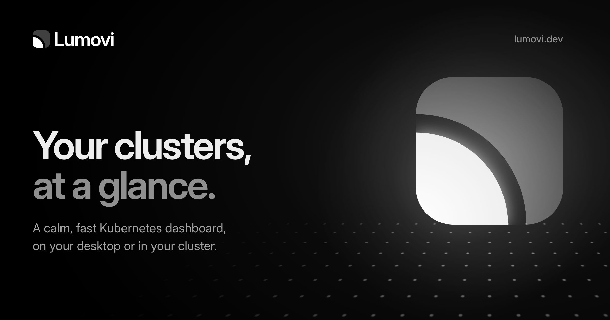

The brand's pictures share one scene: graphite, a floor of dots running off into the distance
(a cluster's worth of pods, seen from above), and the mark standing on it, its light falling on
the floor in front. It's calm: one light, one subject, and plenty of dark. Social cards,
banners, wallpapers and installer windows are all drawn from it, by
[`src/scene.ts`](../src/scene.ts).

For the product itself, show the product: real screenshots of the app, in light and dark.

## Writing about Lumovi

- It's **Lumovi**: one word, capital L. Not LUMOVI, LumoVi or Lumovi App.
- Lumovi is **a Kubernetes dashboard** you run **on your desktop** (macOS, Windows and Linux),
  or **in your cluster** for your whole team.
- **The one line,** the same everywhere: "Lumovi is a calm, fast Kubernetes dashboard, on your
  desktop or in your cluster." In a description or another short field: "A calm, fast
  Kubernetes dashboard, on your desktop or in your cluster." It says what Lumovi is, not how
  good it is: no "beautiful", "powerful" or "modern".
- Link to **[lumovi.dev](https://lumovi.dev)**, and to
  **[docs.lumovi.dev](https://docs.lumovi.dev)** for how to use it. Write the addresses in
  lowercase, without `https://` or `www.`
- Write the way the app talks: plainly, calmly, and to the point. Say what something does, not
  how amazing it is.

## The name and logo are trademarks

The code and the files in this repository are open source (Apache 2.0), but the Lumovi name and
logo identify the Lumovi project, and the license doesn't grant rights to them (see section 6 of
the [license](../LICENSE)).

You're welcome to use the logo to link to or write about Lumovi, in articles, talks, videos
and lists of tools, as long as you follow these guidelines and it's clear the Lumovi project
doesn't endorse you. Don't use the name or logo for your own product, fork, company or domain,
or in a way that suggests it's an official Lumovi project. If you're not sure, open an issue and
ask.
